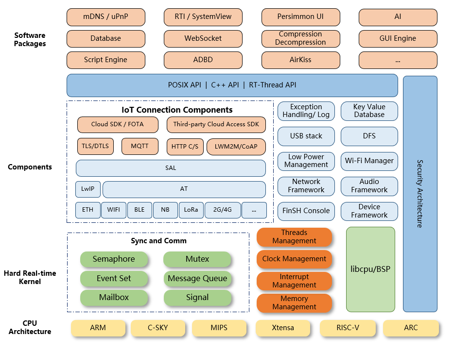
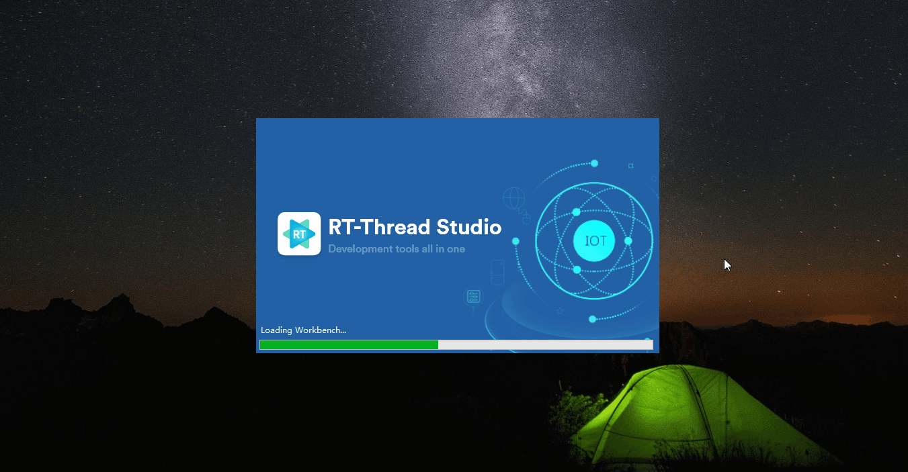
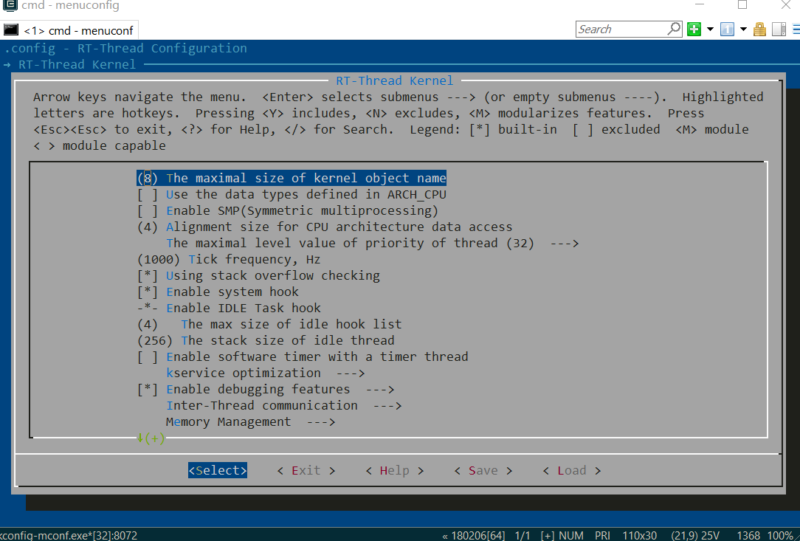

### RT-Thread RTOS Introduction

RT-Thread was born in 2006, it is an open source, neutral, and community-based real-time operating system (RTOS).

RT-Thread is mainly written in C language, easy to understand and easy to port(can be quickly port to a wide range of mainstream MCUs and module chips). It applies object-oriented programming methods to real-time system design, making the code elegant, structured, modular, and very tailorable.

RT-Thread has Standard version and Nano version. For resource-constrained microcontroller (MCU) systems, the NANO kernel version that requires only 3KB Flash and 1.2KB RAM memory resources can be tailored with easy-to-use tools; And for resource-rich IoT devices, RT-Thread can use the on-line software package management tool, together with system configuration tools, to achieve intuitive and rapid modular cutting, seamlessly import rich software packages, thus achieving complex functions like Android's graphical interface and touch sliding effects, smart voice interaction effects, and so on.

### RT-Thread Architecture

RT-Thread has not only a real-time kernel, but also rich components. Its architecture is as follows:



It includes:

- Kernel layer: RT-Thread kernel, the core part of RT-Thread, includes the implementation of objects in the kernel system, such as multi-threading and its scheduling, semaphore, mailbox, message queue, memory management, timer, etc.; libcpu/BSP (Chip Migration Related Files/Board Support Package) is closely related to hardware and consists of peripheral drivers and CPU porting.
- Components and Service Layer: Components are based on upper-level software on top of the RT-Thread kernel, such as virtual file systems, FinSH command-line interfaces, network frameworks, device frameworks, and more. Its modular design allows for high internal cohesion inside the components and low coupling between components.
- [RT-Thread software package](https://packages.rt-thread.org/en/index.html): A general-purpose software component running on the RT-Thread IoT operating system platform for different application areas, consisting of description information, source code or library files. RT-Thread provides an open package platform with officially available or developer-supplied packages that provide developers with a choice of reusable packages that are an important part of the RT-Thread ecosystem. The package ecosystem is critical to the choice of an operating system because these packages are highly reusable and modular, making it easy for application developers to build the system they want in the shortest amount of time. RT-Thread supports more than 370 software packages.

### RT-Thread Features

- Designed for resource-constrained devices, the minimum kernel requires only 1.2KB of RAM and 3 KB of Flash.
- Has rich components and a prosperous and fast growing package ecosystem.
- Elegant code style, easy to use, read and master.
- High Scalability. RT-Thread has high-quality scalable software architecture, loose coupling, modularity, is easy to tailor and expand.
- Supports high-performance applications.
- Supports cross-platform and a wide range of chips.

### Supported IDE and Compiler

The main IDE/compilers supported by RT-Thread are:

- RT-Thread Studio IDE
- MDK KEIL
- IAR
- GCC

### RT-Thread Studio IDE

[User Manual](https://www.rt-thread.io/document/site/rtthread-studio/um/studio-user-manual/) | [Tutorial Videos](https://youtu.be/ucq5eJgZIQg)

RT-Thread Studio IDE (a.k.a. RT-Studio) is a one-stop intergrated development environment built by RT-Thread team. It has a easy-to-use graphical configuration system and a wealth of software packages and components resources. RT-Studio has the features of project creation, configuration and management,as well as code editing, SDK management, build configuration, debugging configuration, program download and debug. We're looking to make the use of RT-Studio as intuitive as possible, reducing the duplication of work and improving the development efficiency.



### Env Tool

[User Manual](https://www.rt-thread.io/document/site/programming-manual/env/env/) | [Tutorial Videos](https://www.youtube.com/watch?v=dEK94o_YoSo)

In the early stage, RT-Thread team also created an auxiliary tool called Env. It is an auxiliary tool with a TUI (Text-based user interface). Developers can use Env tool to configure and generate the GCC, Keil MDK, and IAR projects.



### License

RT-Thread is an open source software and has been licensed under Apache License Version 2.0 since v3.1.1. License information and copyright information can generally be seen at the beginning of the code:

```c
/*
 * Copyright (c) 2006-2024, RT-Thread Development Team
 *
 * SPDX-License-Identifier: Apache-2.0
 *
```

### Community

RT-Thread is very grateful for the support from all community developers, and if you have any ideas, suggestions or questions in the process of using RT-Thread, RT-Thread can be reached by the following means, and we are also updating RT-Thread in real time on these channels. At the same time, any questions can be asked in the [issue section of RT-Thread repository](https://github.com/RT-Thread/rt-thread/issues) or [RT-Thread forum](https://club.rt-thread.io/), and community members will answer them.

[Website](https://www.rt-thread.io/) | [Github](https://github.com/RT-Thread/rt-thread) | [Twitter](https://twitter.com/rt_thread) | [LinkedIn](https://www.linkedin.com/company/rt-thread-iot-os/posts/?feedView=all) | [Youtube](https://www.youtube.com/channel/UCdDHtIfSYPq4002r27ffqPw) | [Facebook](https://www.facebook.com/RT-Thread-IoT-OS-110395723808463/?modal=admin_todo_tour) | [Medium](https://rt-thread.medium.com/)

