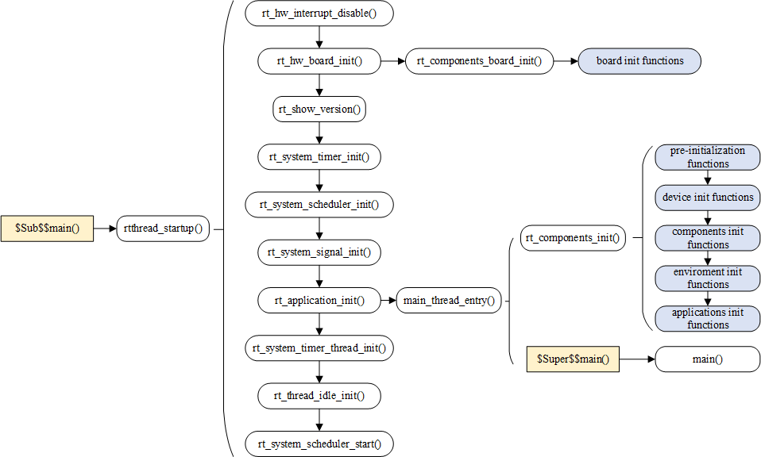

### RT-Thread kernel introduction

The kernel represents the fundamental and indispensable component of an operating system. It bears responsibility for the management of system threads, inter-thread communication, system clock, interrupts and memory. The subsequent figure illustrates the RT-Thread kernel architecture, wherein the kernel is situated above the hardware layer. The kernel section encompasses kernel libraries and the real-time kernel implementation.

The kernel libraries represent a minimal set of C library-like function implementations that guarantee the kernel's capacity to operate independently. This component of the kernel incorporates its own C libraries in a manner that varies depending on the compiler employed. When utilising the GNU GCC compiler, it incorporates a greater number of standard C library implementations.

> It is recommended that the C library, also referred to as the C Runtime Library, be utilized. This library provides analogous functions, such as 'strcpy', 'memcpy', and other related functions. Additionally, it includes the implementation of 'printf' and 'scanf' functions. The 'RT-Thread Kernel Service Library' offers a limited selection of C library functions utilized by the kernel. This approach is employed to prevent any potential conflicts with the standard C library, and thus, these functions are prefixed with 'rt_'.

The implementation of the real-time kernel encompasses a number of key functionalities, including object management, thread management and scheduler, inter-thread communication management, clock management and memory management. The kernel exhibits a minimal resource footprint, requiring only 3KB ROM and 1.2KB RAM.

### Thread Scheduling

In the RT-Thread operating system, a thread represents the smallest scheduling unit. The thread scheduling algorithm is a fully preemptive multi-thread scheduling algorithm based on priority. This means that, with the exception of the interrupt handler function, the code in the locking part of the scheduler, and the code for disabling interrupts, which are non-preemptible, all other parts of the system can be preempted. This includes the thread scheduler itself. The system supports 256 thread priorities, although this can be modified through the configuration file to support up to 32 or 8 thread priorities. The default configuration for the STM32 is 32 thread priorities. Priority 0 represents the highest priority, while the lowest priority is reserved for idle threads. Additionally, the system allows for the creation of multiple threads with the same priority, which are scheduled using the time-slice rotation algorithm. Furthermore, the system permits the creation of multiple threads with identical priorities, which are scheduled using a time-slice rotation algorithm to ensure that each thread is executed for the appropriate duration. Additionally, the scheduler's search time for the highest priority threads in a ready state is constant, and the system does not impose a limit on the number of threads, which is solely dependent on the hardware platform's memory constraints.

### Clock Management

The clock management system of RT-Thread is based on the clock beat, which represents the fundamental unit of time within the RT-Thread operating system. The RT-Thread timer offers two distinct timer mechanisms: the first is the single-trigger timer, which initiates a timer event on a single occasion following startup, after which the timer ceases to function. The second type is the cycle-triggered timer. This type of timer will trigger the timer event at regular intervals until the user manually stops the timer, at which point it will cease to execute.

Furthermore, the RT-Thread timer can be configured to operate in either HARD_TIMER or SOFT_TIMER mode, depending on the context in which the timeout function is invoked.
Typically, the timer timing callback function (i.e. the timeout function) is employed to complete the timing service. Users can select the appropriate type of timer to align with their real-time requirements for timing processing.

### Synchronization between Threads

RT-Thread uses thread semaphores, mutexes, and event sets to achieve inter-thread synchronization. Thread synchronizes through the acquisition and release of semaphore and mutexes; the mutex uses priority inheritance to solve the common priority inversion problem in the real-time system. The thread synchronization mechanism allows threads to wait according to priorities or to acquire semaphores or mutexes following the first-in first-out method. Threads synchronize through sending and receiving of events; event sets allows "or trigger" and "and trigger" for multiple events, suitable for situations where threads are waiting for multiple events.

### Inter-Thread Communication

RT-Thread supports communication mechanisms such as mailbox, message queue, etc. The length of a message in the mailbox is fixed to 4 bytes; message queue can receive messages in variable-length and cache the messages in its own memory space. Compared to message queue, mailbox is more efficient. The sending action of the mailbox and message queue can be safely used in the interrupt service routine. The communication mechanism allows threads to wait by priority or to acquire by first in first out method.

### Memory Management

RT-Thread allows static memory pool management and dynamic memory heap management. When static memory pool has available memory space, the time allocated to the memory block will be constant; when the static memory pool is empty, the system will then request for suspending or blocking the thread of the memory block. (that is, the thread will abandon the request and return, if after waiting for a while, the memory block is not obtained or the thread will abandon and return immediately. The waiting time depends on the waiting time parameter set when the memory block is applied). When other threads release the memory block to the memory pool, if there is threads that are suspending and waiting to be allocated of memory blocks, the system will wake up the thread.

Under circumstances of different system resources, the dynamic memory heap management module respectively provides memory management algorithms for small memory systems and SLAB memory management algorithm for large memory systems.

There is also a dynamic memory heap management called memheap, which is suitable for memory heaps in systems with multiple addresses that can be discontinuous. Using memheap, you can "stick" multiple memory heaps together, letting the user operate as if he was operating a memory heap .

The concept of memory management will be explained in the "Memory Management" chapter.

### RT-Thread Startup Process

The understanding of most codes usually starts from learning the startup process. We will firstly look for the source of the startup. RT-Thread allows multiple platforms and multiple compilers, and the rtthread_startup() function is a uniform entry point specified by RT-Thread. The general execution sequence is: Firstly, the system starts running the Startup file, then enters rtthread_startup(), and finally enters the user program entry main(). The startup process of RT-Thread is as shown below:

### Memory Management

In a computing system, there are usually two types of memory space: internal memory space and external memory space. The internal memory is quick to access and can be accessed randomly according to the variable address. It is what we usually called RAM (Random-Access Memory) and can be understood as the computer's memory. In the external memory, the content stored is relatively fixed, and the data will not be lost even after the power is turned off. It is what we usually called ROM (Read Only Memory) and can be understood as the hard disk of the computer.

In a computer system, variables and intermediate data are generally stored in RAM, and they are only transferred from RAM to CPU for calculation when actually used. The memory size required by some data needs to be determined according to the actual situation during the running of the program, which requires the system to have the ability to dynamically manage the memory space. User applies to the system when he needs a block of memory space, then the system selects a suitable memory space to allocate to the user. After the user finishes using it, the memory space is released back to the system which enables the system to recycle the memory space.

This chapter introduces two kinds of memory management methods in RT-Thread, namely dynamic memory heap management and static memory pool management. After learning this chapter, readers will understand the memory management principle and usage of RT-Thread.

### Memory Management Functional Features

Because time requirements are very strict in real-time systems, memory management is often much more demanding than in general-purpose operating systems:

1) Time for allocating memory must be deterministic. The general memory management algorithm is to find a free memory block that is compatible with the data according to the length of the data to be stored, and then store the data therein. The time it takes to find such a free block of memory is uncertain, but for real-time systems, this is unacceptable. Because real-time system requires that the allocation process of the memory block is completed within a predictable certain time, otherwise the response of the real-time task to the external event will become undeterminable.

2) As memory is constantly being allocated and released, the entire memory area will produce more and more fragments (while using memory, some memory is applied, some of which are released, resulting in some small memory blocks existed in the memory space, these small memory blocks have inconsecutive addresses and cannot be allocated as a whole large block of memory.) There is enough free memory in the system, but because their addresses are inconsecutive, they cannot form a continuous block of complete memory, which will make the program unable to apply for large memory. For general-purpose systems, this inappropriate memory allocation algorithm can be solved by rebooting the system (once every month or once a few months). But it is unacceptable for embedded systems that need to work continuously in the field work all the year round.

3) The resource environment of embedded system is also different. Some systems have relatively tight resources, only tens of kilobytes of memory are available for allocation, while some systems have several megabytes of memory. This makes choosing efficient memory allocation algorithm for these different systems more complicated.

RT-Thread operating system provides different memory allocation management algorithms for memory management according to different upper layer applications and system resources. Generally, it can be divided into two categories: memory heap management and memory pool management. Memory heap management is divided into three cases according to specific memory devices:

The first is allocation management for small memory blocks (small memory management algorithm);

The second is allocation management for large memory blocks (slab management algorithm);

The third is allocation management for multiple memory heaps (memheap management algorithm)

### Memory Heap Management

Memory heap management is used to manage a contiguous memory space. We introduced the memory distribution of RT-Thread in chapter "Kernel Basics". As shown in the following figure, RT-Thread uses the space at "the end of the ZI segment" to the end of the memory as the memory heap.

If current resource allows, memory heap can allocate memory blocks of any size according to the needs of users. When user does not need to use these memory blocks, they can be released back to the heap for other applications to allocate and use. In order to meet different needs, RT-Thread system provides different memory management algorithms, namely small memory management algorithm, slab management algorithm and memheap management algorithm.

The small memory management algorithm is mainly for system with less resources and with less than 2MB of memory. The slab memory management algorithm mainly provides a fast algorithm similar to multiple memory pool management algorithms when the system resources are rich. In addition to the above, RT-Thread also has a management algorithm for multi-memory heap, namely the memheap management algorithm. The memheap management algorithm is suitable for where there are multiple memory heaps in the system. It can “paste” multiple memories together to form a large memory heap, which is very easy to use for users.

Either one or none of these memory heap management algorithms can be chosen when the system is running. These memory heap management algorithms provide the same API interface to the application.

> Because the memory heap manager needs to meet the security allocation in multi-threaded conditions, which means mutual exclusion between multiple threads needs to be taken into consideration, so please do not allocate or release dynamic memory blocks in interrupt service routine, which may result in the current context being suspended.