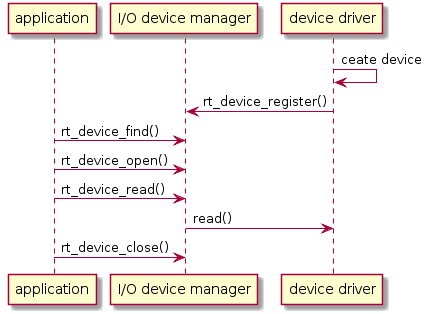
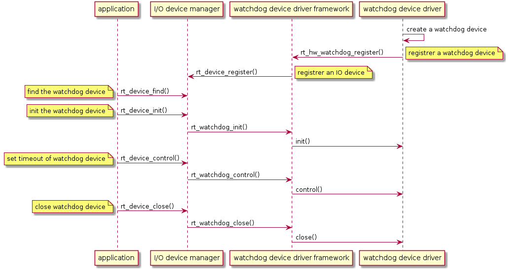
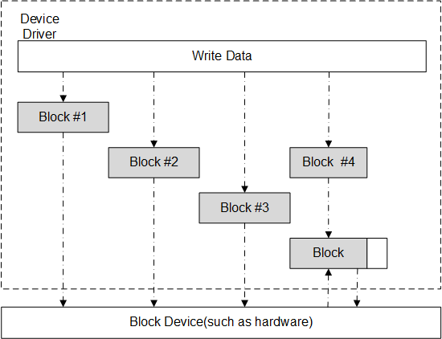

### I/O Device Framework

Most embedded systems include some I/O (Input/Output) devices, data displays on instruments, serial communication on industrial devices, Flash or SD cards for saving data on data acquisition devices,as well as Ethernet interfaces for network devices, are examples of I/O devices that are commonly seen in embedded systems.

This chapter describes how RT-Thread manages different I/O devices.

### I/O Device Introduction

#### I/O Device Framework

RT-Thread provides a set of I/O device framework, as shown in the following figure. It is located between the hardware and the application. It is divided into three layers. From top to bottom, they are I/O device management layer, device driver framework layer, and device driver layer.


The application obtains the correct device driver through the I/O device management interface, and then uses this device driver to perform data (or control) interaction with the bottom I/O hardware device.

The I/O device management layer implements the encapsulation of device drivers. The application accesses the bottom devices through the standard interface provided by the I/O device layer. The upgrade and replacement of the device driver will not affect the upper layer application. In this way, the hardware-related code of the device can exist independently of the application, and both parties only need to pay attention to the respective function implementation, thereby reducing the coupling and complexity of the code and improving the reliability of the system.

The device driver framework layer is an abstraction of the same kind of hardware device driver. The same part of the same hardware device driver of different manufacturers is extracted, and the different parts are left out of interface, implemented by the driver.

The device driver layer is a set of programs that drive the hardware devices to work, enabling access to hardware devices. It is responsible for creating and registering I/O devices. For devices with simple operation logic, you can register devices directly into the I/O Device Manager without going through the device driver framework layer. The sequence diagram is as shown below. There are mainly two points:

* The device driver creates a device instance with hardware access capabilities based on the device model definition and registers the device with the  `rt_device_register()` interface in the I/O Device Manager.
* The application finds the device through the`rt_device_find()` interface and then uses the I/O device management interface to access the hardware.



For other devices, such as watchdog, the created device instance will be registered to the corresponding device driver framework, and then the device driver framework will register with the I/O device manager. The main points are as follows:

* The watchdog device driver creates a watchdog device instance with hardware access capability based on the watchdog device model definition and registers the watchdog device through the  `rt_hw_watchdog_register()` interface into the watchdog device driver framework.
* The watchdog device driver framework registers the watchdog device to the I/O Device Manager via the `rt_device_register()`  interface.
* The application accesses the watchdog device hardware through the I/O device management interface.

Usage of Watchdog device:



### I/O Device Model

The device model of RT-Thread is based on the kernel object model, which is considered a kind of objects and is included in the scope of the object manager. Each device object is derived from the base object. Each concrete device can inherit the properties of its parent class object and derive its own properties. The following figure is a schematic diagram of the inheritance and derivation relationship of device object.


The specific definitions of device objects are as follows:

```c
struct rt_device
{
    struct rt_object          parent;        /* kernel object base class */
    enum rt_device_class_type type;          /* device type */
    rt_uint16_t               flag;          /* device parameter */
    rt_uint16_t               open_flag;     /* device open flag */
    rt_uint8_t                ref_count;     /* number of times the device was cited */
    rt_uint8_t                device_id;     /* device ID,0 - 255 */

    /* data transceiving callback function */
    rt_err_t (*rx_indicate)(rt_device_t dev, rt_size_t size);
    rt_err_t (*tx_complete)(rt_device_t dev, void *buffer);

    const struct rt_device_ops *ops;    /* device operate methods */

    /* device's private data */
    void *user_data;
};
typedef struct rt_device *rt_device_t;

```

### I/O Device Type

RT-Thread supports multiple I/O device types, the main device types are as follows:

```c
RT_Device_Class_Char             /* character device       */
RT_Device_Class_Block            /* block device         */
RT_Device_Class_NetIf            /* network interface device    */
RT_Device_Class_MTD              /* memory device       */
RT_Device_Class_RTC              /* RTC device        */
RT_Device_Class_Sound            /* sound device        */
RT_Device_Class_Graphic          /* graphic device        */
RT_Device_Class_I2CBUS           /* I2C bus device     */
RT_Device_Class_USBDevice        /* USB device */
RT_Device_Class_USBHost          /* USB host device   */
RT_Device_Class_SPIBUS           /* SPI bus device     */
RT_Device_Class_SPIDevice        /* SPI device        */
RT_Device_Class_SDIO             /* SDIO device       */
RT_Device_Class_Miscellaneous    /* miscellaneous devices       */
```

Character devices and block devices are commonly used device types, and their classification is based on the transmission processing between device data and the system. Character mode devices allow for unstructured data transfers, that is, data usually transfers in the form of serial, one byte at a time. Character devices are usually simple devices such as serial ports and buttons.

A block device transfers one data block at a time, for example 512 bytes data at a time. This data block is enforced by the hardware. Data blocks may use some type of data interface or some mandatory transport protocol, otherwise an error may occur. Therefore, sometimes the block device driver must perform additional work on read or write operations, as shown in the following figure:



When the system serves a write operation with a large amount of data, the device driver must first divide the data into multiple packets, each with the data size specified by the device. In the actual process, the last part of the data size may be smaller than the normal device block size. Each block in the above figure is written to the device using a separate write request, and the first three are directly written. However, the last data block size is smaller than the device block size, and the device driver must process the last data block differently than the first 3 blocks. Normally, the device driver needs to first perform a read operation of the corresponding device block, then overwrite the write data onto the read data, and then write the "composited" data block back to the device as a whole block. . For example, for block 4 in the above figure, the driver needs to read out the device block corresponding to block 4, and then overwrite the data to be written to the data read from the device block, and merge them into a new block. Finally write back to the block device.

The above is a brief introduction to RT-Thread's I/O device management framework, which will be described in Chapter 5.

