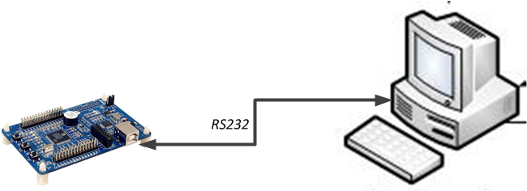
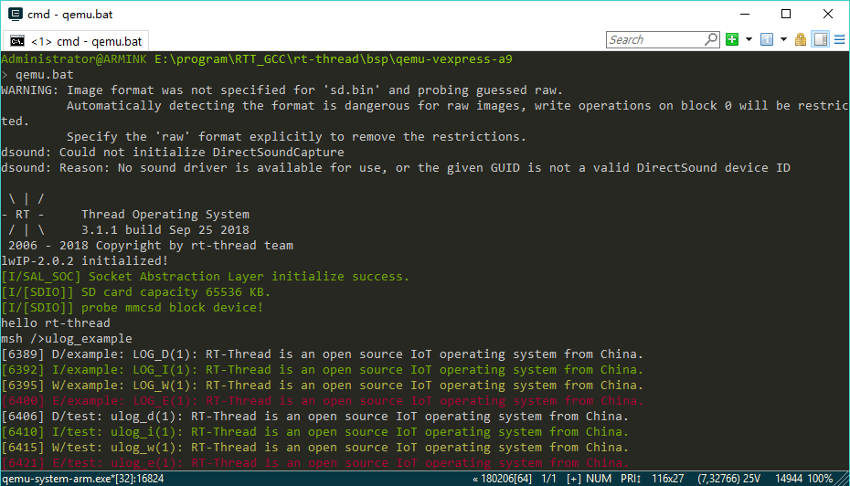

### Component Introduction

The RT-Thread platform incorporates a multitude of commonly utilized components that, when enabled, can readily facilitate the integration of sophisticated functionality, thereby enabling the development of more advanced embedded systems. The RT-Thread platform encompasses a plethora of pre-integrated components, including C libraries, networking components, FinSh console components, FAL components, ulog components, and numerous others. Concurrently, RT-Thread offers a comprehensive array of software packages that can be expediently incorporated into a project via online means. The subsequent section delineates some of the most frequently utilized components and online packages.

### LIBC library

#### brief introduction

The LIBC (C library) provided by RT-Thread consists of three parts: the compiler built-in LIBC leveling layer and the POSIX layer. The layout is shown in the following figure:


#### LIBC levelling layer

The LIBC levelling layer is responsible for interfacing with the underlying stub functions of the compiler toolchain's built-in LIBC and for balancing the differences in the degree of implementation of the compiler's built-in LIBC APIs. It is designed to provide a functionally unified interface to the upper POSIX layer and is located in the[components/libc/compiler](https://github.com/RT-Thread/rt-thread/tree/master/components/libc/compilers) directory.  The rationale behind the levelling process is that the four compilation toolchains, namely GCC (newlib), Keil-MDK, IAR, and Visual Studio (WIN32), exhibit disparate levels of support for the standard C library functions provided by the built-in LIBC. Consequently, the LIBC levelling layer assumes the responsibility of harmonising the standard C libraries provided by the four distinct compilation toolchains to a uniform level. The LIBC levelling layer does not necessitate manual intervention by the user; instead, it automatically levels the libraries in accordance with the compilation platform and toolchain employed by the user during project compilation. This guarantees that the upper layer is not required to distinguish between LIBCs for the specific compilation platform and toolchain used, and that LIBC-related functions can be referenced using common header files.

#### ISO/ANSI C standard

The terms ANSI C, ISO C, and Standard C collectively refer to the standards issued by the American National Standards Institute (ANSI) and the International Organization for Standardization (ISO) for the C language. In its historical context, the designation was employed exclusively to denote the original, and most rigorously validated, iteration of this standard, which was designated C89 or C90. Those engaged in software development utilising the C language were encouraged to adhere to the stipulations set forth by the standard, as this facilitated the utilisation of cross-platform code. The inaugural standard for the C language was published by ANSI. The initial standard for C was published by ANSI. Despite the subsequent adoption of this document by the International Organization for Standardization (ISO) and the subsequent publication of revisions by ISO that have been adopted by ANSI, the designation ANSI C (as opposed to ISO C) remains prevalent in usage. Some software developers employ the designation "ISO C," while others utilize the impartial appellation "Standard C." For instance, the terms "C89" (ANSI X3.159-1989), "C99" (ISO/IEC 9899:1999), and "C11" (ISO/IEC 9899:2011) actually pertain to disparate versions of the standard.

It is typical for this standard to be supported by compiler/toolchain-built-in LIBCs. For example, Keil-MDK and IAR provide built-in LIBCs that fulfil this standard.

#### POSIX standard

Portable Operating System Interface (English: Portable Operating System Interface, abbreviated as POSIX) is an umbrella term for a series of interrelated IEEE standards that define APIs for running software on a variety of UNIX operating systems, formally known as IEEE Std 1003, and the international standard name is ISO/IEC 9945. ISO/ANSI C is a subset of POSIX.

##### IEEE Std 1003.1

For LIBC, the widely used POSIX standard is the 1003.1 standard, known as IEEE Std 1003.1 (abbreviated as POSIX.1.) IEEE Std 1003.1-2001, IEEE Std 1003.1-2008, and so on, are the versions of POSIX.1 that have been updated and released at different times.

##### IEEE Std. 1003.13

The standard is a POSIX specification for real-time profiles. It is a subset of the International Electrotechnical Commission (IEC) 60870-1 standard, which was derived from the IEEE Std 1003.13 standard, which defines four subsets:

- Minimal: The minimal embedded subset specification (PSE51)
The controller subset specification (PSE52) A further subset specification has been developed for larger embedded systems, designated PSE53.
A second subset specification has been created for large-scale general-purpose systems with real-time requirements, designated PSE54.

### Network Framework

With the popularity of the Internet, people's lives are increasingly dependent on the application of the network. More and more products need to connect to the Internet, and device networking has become a trend. To achieve the connection between the device and the network, you need to follow the TCP/IP protocol, you can run the network protocol stack on the device to connect to the network, or you can use devices (chips with hardware network protocol stack interfaces) to connect to the Internet.

When the device is connected to the network, it is like plugging in the wings. You can use the network to upload data in real time. The user can see the current running status and collected data of the device in a hundred thousand miles, and remotely control the device to complete specific tasks. You can also play online music, make online calls, and act as a LAN storage server through your device.

This chapter will explain the related content of the RT-Thread network framework, and introduce you to the concept, function and usage of the network framework. After reading this chapter, you will be familiar with the concept and implementation principle of the RT-Thread network framework and familiar with  network programming using Socket API.

#### TCP/IP Introduction to Network Protocols

TCP/IP is short for Transmission Control Protocol/Internet Protocol. It is not a single protocol, but a general term for a protocol family. It includes IP protocol, ICMP protocol, TCP protocol, and http and ftp, pop3, https protocol, etc., which define how electronic devices connect to the Internet and the standards by which data is transferred between them.

#### OSI Reference Model

OSI (Open System Interconnect), which is an open system interconnection. Generally referred to as the OSI reference model, it is a network interconnection model studied by the ISO (International Organization for Standardization) in 1985.  The architecture standard defines a seven-layer framework for the network interconnection (physical layer, data link layer, network layer, transport layer, session layer, presentation layer, and application layer), that is, the ISO open system interconnection reference model. The first to third layers belong to the lower three layers of the OSI Reference Model and are responsible for creating links for network communication connections; the fourth to seventh layers are the upper four layers of the OSI reference model and is responsible for end-to-end data communication. The capabilities of each layer are further detailed in this framework to achieve interconnectivity, interoperability, and application portability in an open system environment.

#### TCP/IP Reference Model

The TCP/IP communication protocol uses a four-layer hierarchical structure, and each layer calls the network provided by its next layer to fulfill its own needs. The four layers are:

* **Application layer**: Different types of network applications have different communication rules, so the application layer protocols are various, such as Simple Mail Transfer Protocol (SMTP), File Transfer Protocol (FTP), and network remote access protocol (Telnet).
* **Transport layer**: In this layer, it provides data transfer services between nodes, such as Transmission Control Protocol (TCP), User Datagram Protocol (UDP), etc. TCP and UDP add data to the data packet and transmit it to the next layer, this layer is responsible for transmitting data and determining that the data has been delivered and received.
* **Network layer**: responsible for providing basic data packet transfer functions, so that each packet can reach the destination host (but not check whether it is received correctly), such as Internet Protocol (IP).
* **Network interface layer**: Management of actual network media, defining how to use actual networks (such as Ethernet, Serial Line, etc.) to transmit data.

#### Difference between TCP/IP Reference Model and OSI Reference Model

The following figure shows the TCP/IP reference model and the OSI reference model diagram:


Both the OSI reference model and the TCP/IP reference model are hierarchical, based on the concept of a separate protocol stack. The OSI reference model has 7 layers, while the TCP/IP reference model has only 4 layers, that is, the TCP/IP reference model has no presentation layer and session layer, and the data link layer and physical layer are merged into a network interface layer. However, there is a certain correspondence between the two layers. Due to the complexity of the OSI system and the design prior to implementation, many designs are too ideal and not very convenient for software implementation. Therefore, there are not many systems that fully implement the OSI reference model, and the scope of application is limited. The TCP/IP reference model was first implemented in a computer system. It has a stable implementation on UNIX and Windows platforms, and provides a simple and convenient programming interface (API) on which a wide range of applications are developed. The TCP/IP reference model has become the international standard and industry standard for Internet connectivity.

#### IP Address

The IP address refers to the Internet Protocol Address (also translated as the Internet Protocol Address) and is a uniform address format that assigns a logical address to each network and each host on the Internet to mask physical address differences provided by  Internet Protocol. The common LAN IP address is 192.168.X.X.

#### Subnet Mask

Subnet mask (also called netmask, address mask), which is used to indicate which bits of an IP address identify the subnet where the host is located, and which bits are identified as the bit mask of the host. The subnet mask cannot exist alone, it must be used in conjunction with an IP address. Subnet mask has only one effect, which is to divide an IP address into two parts: network address and host address. The subnet mask is the bit of 1, the IP address is the network address, the subnet mask is the bit of 0, and the IP address is the host address. Taking the IP address 192.168.1.10 and the subnet mask 255.255.255.0 as an example, the first 24 bits of the subnet mask (converting decimal to binary) is 1, so the first 24 bits of the IP address 192.168.1 represent the network address. The remaining 0 is the host address.

#### MAC Address

MAC (figures Access Control or Medium Access Control) address, which is translated as media access control, or physical address, hardware address, used to define the location of  network devices. In OSI model, the third layer network Layer is responsible for IP address, the second layer data link layer is responsible for the MAC address. A host will have at least one MAC address.

#### Introduction to the Network Framework of RT-Thread

In order to support various network protocol stacks, RT-Thread has developed a **SAL** component, the full name of the **Socket abstraction layer**. RT-Thread can seamlessly access various protocol stacks, including several commonly used TCP/IP protocol stack, such as the LwIP protocol stack commonly used in embedded development and the AT Socket protocol stack component developed by RT-Thread, which complete the conversion of data from the network layer to the transport layer.

The main features of the RT-Thread network framework are as follows:

* Support for standard network sockets BSD Socket API, support for poll/select
* Abstract, unified multiple network protocol stack interfaces
* Support various physical network cards, network communication module hardware
* The resource occupancy of SAL socket abstraction layer component is small: ROM 2.8K and RAM 0.6K.

RT-Thread's network framework adopts a layered design with four layers, each layer has different responsibilities. The following figure shows the RT-Thread network framework structure:


The network framework provides a standard BSD Socket interface to user applications. Developers use the BSD Socket interface to operate without worrying about how the underlying network is implemented, and no need to care which network protocol stack the network data passes through. The socket abstraction layer provides the upper application layer. The interfaces are: `accept`, `connect`, `send`, `recv`, etc.

Below the SAL layer is the protocol stack layer. The main protocol stacks supported in the current network framework are as follows:

* **LwIP** is an open source TCP/IP protocol stack implementation that reduces RAM usage while maintaining the main functionality of the TCP/IP protocol, making the LwIP protocol stack ideal for use in embedded systems.
* **AT Socket** is a component for modules that support AT instructions. The AT command uses a standard serial port for data transmission and reception, and converts complex device communication methods into simple serial port programming, which greatly simplifies the hardware design and software development costs of the product, which makes almost all network modules such as GPRS, 3G/4G, NB-IoT, Bluetooth, WiFi, GPS and other modules are very convenient to access the RT-Thread network framework, develop network applications through the standard BSD Socket method, greatly simplifying the development of upper-layer applications.
* **Socket CAN** is a way of programming CAN, it is easy to use and easy to program. By accessing the SAL layer, developers can implement Socket CAN programming on RT-Thread.

Below the protocol stack layer is an abstract device layer that is connected to various network protocol stacks by abstracting hardware devices into Ethernet devices or AT devices.

The bottom layer is a variety of network chips or modules (for example: Ethernet chips with built-in protocol stack such as W5500/CH395, WiFi module with AT command, GPRS module, NB-IoT module, etc.). These hardware modules are the carrier that truly performs the network communication function and is responsible for communicating with various physical networks.

In general, the RT-Thread network framework allows developers to only care about and use the standard BSD Socket network interface for network application development, without concern for the underlying specific network protocol stack type and implementation, greatly improving system compatibility and convenience. Developers have completed the development of network-related applications, and have greatly improved the compatibility of RT-Thread in different areas of the Internet of Things.

In addition, based on the network framework, RT-Thread provides a large number of network software packages, which are various network applications based on the SAL layer, such as **Paho MQTT**, **WebClient**, **cJSON**, **netutils**, etc., which can be obtained from the online package management center. These software packages are web application tools. Using them can greatly simplify the development of network applications and shorten the network application development cycle. At present, there are more than a dozen network software packages. The following table lists some of the network software packages currently supported by RT-Thread, and the number of software packages is still increasing.

| **Package Name** | **Description**                                              |
| ---------------- | ------------------------------------------------------------ |
| Paho MQTT        | Based on Eclipse open source Paho MQTT, it has done a lot of functions and performance optimization, such as: increased automatic reconnection after disconnection, pipe model, support for non-blocking API, support for TLS encrypted transmission, etc. |
| WebClient        | Easy-to-use HTTP client with support for HTTP GET/POST and other common request functions, support for HTTPS, breakpoint retransmission, etc. |
| mongoose         | Embedded Web server network library, similar to Nginx in the embedded world. Licensing is not friendly enough, business needs to be charged |
| WebTerminal      | Access Finsh/MSH Shell packages in the browser or on the mobile |
| cJSON            | Ultra-lightweight JSON parsing library                       |
| ljson            | Json to struct parsing, output library                       |
| ezXML            | XML file parsing library, currently does not support parsing XML data |
| nanopb           | Protocol Buffers format data parsing library, Protocol Buffers format takes up less resources than JSON, XML format resources |
| GAgent           | Software package for accessing Gizwits Cloud Platform        |
| Marvell WiFi     | Marvell WiFi driver                                          |
| Wiced WiFi       | WiFi driver for Wiced interface                              |
| CoAP             | Porting libcoap's CoAP communication package                 |
| nopoll           | Ported open source WebSocket communication package           |
| netutils         | A collection of useful network debugging gadgets, including: ping, TFTP, iperf, NetIO, NTP, Telnet, etc. |
| OneNet           | Software for accessing China Mobile OneNet Cloud             |

### FinSH Console

In the early days of computer development, before the advent of graphics systems, there was no mouse or even a keyboard. How did people interact with computers at the time? The earliest computers used a punched note to enter commands into the computer and write the program. Later, with the continuous development of computers, monitors and keyboards became the standard configuration of computers, but the operating system at this time did not support the graphical interface. Computer pioneers developed a software that accepts commands entered by the user, and after interpretation, passes it to The operating system and return the results of the operating system execution to the user. This program wraps around the operating system like a layer of shell, so it's called a shell.

Embedded devices usually need to connect the development board to the PC for communication. Common connections include: serial port, USB, Ethernet, Wi-Fi, etc. A flexible shell should also support working on multiple connection methods. With the shell, the developer can easily get the system running and control the operation of the system through commands. Especially in the debugging phase, with the shell, in addition to being able to locate the problem more quickly, the developer can also use the shell to call the test function, change the parameters of the test function, reduce the number of times the code is downloaded, and shorten the development time of the project.

FinSH is the command line component (shell) of RT-Thread. It is based on the above considerations. FinSH is pronounced [ˈfɪnʃ]. After reading this chapter, we will have a deeper understanding of how FinSH works and how to export your own commands to FinSH.

#### Introduction of FinSH

FinSH is the command line component of RT-Thread. It provides a set of operation interfaces for users to call from the command line. It is mainly used to debug or view system information. It can communicate with a PC using serial/Ethernet/USB, etc. The hardware topology is shown below:



The user inputs a command in the control terminal, and the control terminal transmits the command to the FinSH in the device through the serial port, USB, network, etc., FinSH will read the device input command, parse and automatically scan the internal function table, find the corresponding function name, and execute the function. The response is output, the response is returned through the original path, and the result is displayed on the control terminal.

When using a serial port to connect a device to a control terminal, the execution flow of the FinSH command is as follows:


FinSH supports the rights verification function. After the system is started, the system will perform the rights verification. Only when the rights verification is passed, the FinSH function will be enabled. This improves the security of system input.

FinSH supports auto-completion, and viewing history commands, etc. These functions can be easily accessed through the keys on the keyboard. The keys supported by FinSH are shown in the following table:

| Keys          | **Functional Description**                                   |
| ------------- | ------------------------------------------------------------ |
| Tab key       | Pressing the Tab key when no characters are entered will print all commands supported by the current system. If you press the Tab key when you have entered some characters, it will find the matching command, and will also complete the file name according to the file system's current directory, and you can continue to input, multiple completions. |
| ↑↓ key        | Scroll up and down the recently entered history command      |
| Backspace key | Delete character                                             |
| ←→ key        | Move the cursor left or right                                |

FinSH supports two input modes, the traditional command line mode and the C language interpreter mode.

#### Traditional Command Line Mode

This mode is also known as msh(module shell). In msh mode, FinSH is implemented in the same way as the traditional shell (dos/bash). For example, you can switch directories to the root directory with the `cd /` command.

MSH can parse commands into parameters and parameters separated by spaces. Its command execution format is as follows:

```
command [arg1] [arg2] [...]
```

The command can be either a built-in command in RT-Thread or an executable file.

#### C Language Interpreter Mode

This mode is also known as C-Style mode. In C language interpreter mode, FinSH can solve and parse most C language expressions, and use functions like C to access functions and global variables in the system. In addition, it can create variables through the command line. In this mode, the command entered must be similar to the function call in C language, that is, you must carry the `()` symbol. For example, to output all current threads and their status in the system, type `list_thread()` in FinSH to print out the required information. The output of the FinSH command is the return value of this function. For some functions that do not have a return value (void return value), this printout has no meaning.

Initially FinSH only supported C-Style mode. Later, with the development of RT-Thread, C-Style mode is not convenient when running scripts or programs, and it is more convenient to use traditional shell method. In addition, in C-Style mode, FinSH takes up a lot of volume. For these reasons, the msh mode has been added to RT-Thread. The msh mode is small and easy to use. It is recommended that you use the msh mode.

If both modes are enabled in the RT-Thread, they can be dynamically switched. Enter the `exit` in msh mode and press `Enter` to switch to C-Style mode. Enter `msh()` in C-Style mode and press `Enter` to enter msh mode. The commands of the two modes are not common, and the msh command cannot be used in C-Style mode, and vice versa.

#### FinSH Built-in Commands

Some FinSH commands are built in by default in RT-Thread. You can print all commands supported by the current system by entering help in FinSH and pressing Enter or directly pressing Tab. The built-in commands in C-Style and msh mode are basically the same, so msh is taken as an example here.

In msh mode, you can list all currently supported commands by pressing the Tab key. The number of default commands is not fixed, and the various components of RT-Thread will output some commands to FinSH. For example, when the DFS component is opened, commands such as `ls`, `cp`, and `cd` are added to FinSH for developers to debug.

The following are all currently supported commands that display RT-Thread kernel status information after pressing the Tab key. The command name is on the left and the description of the command on the right:

```c
RT-Thread shell commands:
version         - show RT-Thread version information
list_thread     - list thread
list_sem        - list semaphore in system
list_event      - list event in system
list_mutex      - list mutex in system
list_mailbox    - list mail box in system
list_msgqueue   - list message queue in system
list_timer      - list timer in system
list_device     - list device in system
exit            - return to RT-Thread shell mode.
help            - RT-Thread shell help.
ps              - List threads in the system.
time            - Execute command with time.
free            - Show the memory usage in the system.
```

Here lists the field information returned after entering the common commands, so that the developer can understand the content of the returned information.

#### Display Thread Status

Use the `ps` or `list_thread` command to list all thread information in the system, including thread priority, state, maximum stack usage, and more.

```c
msh />list_thread
thread   pri  status      sp     stack size max used left tick  error
-------- ---  ------- ---------- ----------  ------  ---------- ---
tshell    20  ready   0x00000118 0x00001000    29%   0x00000009 000
tidle     31  ready   0x0000005c 0x00000200    28%   0x00000005 000
timer      4  suspend 0x00000078 0x00000400    11%   0x00000009 000
```

list_thread Return field description:

| **Field**  | **Description**                                   |
| ---------- | ------------------------------------------------- |
| thread     | Thread name                                       |
| pri        | Thread priority                                   |
| status     | The current state of the thread                   |
| sp         | The current stack position of the thread          |
| stack size | Thread stack size                                 |
| max used   | The maximum stack position used in thread history |
| left tick  | The number of remaining ticks of the thread       |
| error      | Thread error code                                 |

#### Display Semaphore Status

Use the `list_sem` command to display all semaphore information in the system, including the name of the semaphore, the value of the semaphore, and the number of threads waiting for this semaphore.

```c
msh />list_sem
semaphore v   suspend thread
-------- --- --------------
shrx     000 0
e0       000 0
```

list_sem  Return field description:

| **Field**      | **Description**                                  |
| -------------- | ------------------------------------------------ |
| semaphore      | Semaphore name                                   |
| v              | The current value of semaphore                   |
| suspend thread | The number of threads waiting for this semaphore |

#### Display Event Status

Use the `list_event` command to display all event information in the system, including the event name, the value of the event, and the number of threads waiting for this event.

```c
msh />list_event
event      set    suspend thread
-----  ---------- --------------
```

list_event Return field description:

| Field          | **Description**                                              |
| -------------- | ------------------------------------------------------------ |
| event          | Event set name                                               |
| set            | The current event in the event set                           |
| suspend thread | The number of threads waiting for an event in this event set |

#### Display Mutex Status

Use the `list_mutex` command to display all mutex information in the system, including the mutex name, the owner of the mutex, and the number of nestings the owner holds on the mutex.

```c
msh />list_mutex
mutex    owner    hold suspend thread
-------- -------- ---- --------------
fat0     (NULL)   0000 0
sal_lock (NULL)   0000 0
```

list_mutex Return field description:

| **Field**      | **Description**                                        |
| -------------- | ------------------------------------------------------ |
| mutxe          | Mutex name                                             |
| owner          | The thread currently holding the mutex                 |
| hold           | The number of times the holder is nested on this mutex |
| suspend thread | The number of threads waiting for this mutex           |

#### Display Mailbox Status

Use the `list_mailbox` command to display all mailbox information in the system, including the mailbox name, the number of messages in the mailbox, and the maximum number of messages the mailbox can hold.

```c
msh />list_mailbox
mailbox  entry size suspend thread
-------- ----  ---- --------------
etxmb    0000  0008 1:etx
erxmb    0000  0008 1:erx
```

list_mailbox Return field description:

| Field          | **Description**                                   |
| -------------- | ------------------------------------------------- |
| mailbox        | Mailbox name                                      |
| entry          | The number of messages included in the mailbox    |
| size           | The maximum number of messages a mailbox can hold |
| suspend thread | The number of threads waiting for this mailbox    |

#### Display Message Queue Status

Use the `list_msgqueue` command to display all message queue information in the system, including the name of the message queue, the number of messages it contains, and the number of threads waiting for this message queue.

```c
msh />list_msgqueue
msgqueue entry suspend thread
-------- ----  --------------
```

list_msgqueue Return field description:

| Field          | **Description**                                              |
| -------------- | ------------------------------------------------------------ |
| msgqueue       | Message queue name                                           |
| entry          | The number of messages currently included in the message queue |
| suspend thread | Number of threads waiting for this message queue             |

#### Display Memory Pool Status

Use the `list_mempool` command to display all the memory pool information in the system, including the name of the memory pool, the size of the memory pool, and the maximum memory size used.

```c
msh />list_mempool
mempool block total free suspend thread
------- ----  ----  ---- --------------
signal  0012  0032  0032 0
```

list_mempool Return field description:

| Field          | **Description**                                    |
| -------------- | -------------------------------------------------- |
| mempool        | Memory pool name                                   |
| block          | Memory block size                                  |
| total          | Total memory block                                 |
| free           | Free memory block                                  |
| suspend thread | The number of threads waiting for this memory pool |

#### Display Timer Status

Use the `list_timer` command to display all the timer information in the system, including the name of the timer, whether it is the periodic timer, and the number of beats of the timer timeout.

```c
msh />list_timer
timer     periodic   timeout       flag
-------- ---------- ---------- -----------
tshell   0x00000000 0x00000000 deactivated
tidle    0x00000000 0x00000000 deactivated
timer    0x00000000 0x00000000 deactivated
```

list_timer Return field description:

| Field    | **Description**                                              |
| -------- | ------------------------------------------------------------ |
| timer    | Timer name                                                   |
| periodic | Whether the timer is periodic                                |
| timeout  | The number of beats when the timer expires                   |
| flag     | The state of the timer, activated indicates active, and deactivated indicates inactive |

#### Display Device Status

Use the `list_device` command to display all device information in the system, including the device name, device type, and the number of times the device was opened.

```c
msh />list_device
device         type      ref count
------ ----------------- ----------
e0     Network Interface 0
uart0  Character Device  2
```

list_device Return field description:

| Field     | Description                               |
| --------- | ----------------------------------------- |
| device    | Device name                               |
| type      | Device type                               |
| ref count | The number of times the device was opened |

#### Display Dynamic Memory Status

Use the `free` command to display all memory information in the system.

```c
msh />free
total memory: 7669836
used memory : 15240
maximum allocated memory: 18520
```

free Return field description:

| Field                    | Description              |
| ------------------------ | ------------------------ |
| total memory             | Total memory size        |
| used memory              | Used memory size         |
| maximum allocated memory | Maximum allocated memory |

#### Custom FinSH Command

In addition to the commands that come with FinSH, FinSH also provides multiple macro interfaces to export custom commands. The exported commands can be executed directly in FinSH.

##### Custom msh Command

The custom msh command can be run in msh mode. To export a command to msh mode, you can use the following macro interface：

```
MSH_CMD_EXPORT(name, desc);
```

| **Parameter** | **Description**                   |
| ------------- | --------------------------------- |
| name          | The command to export             |
| desc          | Description of the export command |

This command can export commands with parameters, or export commands without parameters. When exporting a parameterless command, the input parameter of the function is void. The example is as follows：

```c
void hello(void)
{
    rt_kprintf("hello RT-Thread!\n");
}

MSH_CMD_EXPORT(hello , say hello to RT-Thread);
```

When exporting a command with parameters, the function's input parameters are `int argc` and `char**argv`. Argc represents the number of arguments, and argv represents a pointer to a command-line argument string pointer array. An example of exporting a parameter command is as follows:

```c
static void atcmd(int argc, char**argv)
{
    ……
}

MSH_CMD_EXPORT(atcmd, atcmd sample: atcmd <server|client>);
```

#### Custom C-Style Commands and Variables

Export custom commands to C-Style mode can use the following interface：

```
FINSH_FUNCTION_EXPORT(name, desc);
```

| **Parameter** | **Description**                   |
| ------------- | --------------------------------- |
| name          | The command to export             |
| desc          | Description of the export command |

The following example defines a `hello` function and exports it as a command in C-Style mode：

```c
void hello(void)
{
    rt_kprintf("hello RT-Thread!\n");
}

FINSH_FUNCTION_EXPORT(hello , say hello to RT-Thread);
```

In a similar way, you can also export a variable that can be accessed through the following interface：

```
FINSH_VAR_EXPORT(name, type, desc);
```

| Parameter | **Description**                      |
| --------- | ------------------------------------ |
| name      | The variable to be exported          |
| type      | Type of variable                     |
| desc      | Description of the exported variable |

The following example defines a `dummy` variable and exports it to a variable command in C-Style mode.：

```c
static int dummy = 0;
FINSH_VAR_EXPORT(dummy, finsh_type_int, dummy variable for finsh)
```

#### Custom Command Rename

The function name length of FinSH is limited. It is controlled by the macro definition `FINSH_NAME_MAX` in `finsh.h`. The default is 16 bytes, which means that the FinSH command will not exceed 16 bytes in length. There is a potential problem here: when a function name is longer than FINSH_NAME_MAX, after using FINSH_FUNCTION_EXPORT to export the function to the command table, the full function name is seen in the FinSH symbol table, but a full node execution will result in a *null node* error. This is because although the full function name is displayed, in fact FinSH saves the first 16 bytes as a command. Too many inputs will result in the command not being found correctly. In this case, you can use `FINSH_FUNCTION_EXPORT_ALIAS` to re-export the command name.

```
FINSH_FUNCTION_EXPORT_ALIAS(name, alias, desc);
```

| Parameter | Description                                        |
| --------- | -------------------------------------------------- |
| name      | The command to export                              |
| alias     | The name that is displayed when exporting to FinSH |
| desc      | Description of the export command                  |

The command can be exported to msh mode by adding `__cmd_` to the renamed command name. Otherwise, the command will be exported to C-Style mode. The following example defines a `hello` function and renames it to `ho` and exports it to a command in C-Style mode.

```c
void hello(void)
{
    rt_kprintf("hello RT-Thread!\n");
}

FINSH_FUNCTION_EXPORT_ALIAS(hello , ho, say hello to RT-Thread);
```

#### FinSH Function Configuration

The FinSH function can be cropped, and the macro configuration options are defined in the rtconfig.h file. The specific configuration items are shown in the following table.

| **Macro Definition**            | **Value Type** | Description                                                | Default  |
| ------------------------------- | -------------- | ---------------------------------------------------------- | -------- |
| #define RT_USING_FINSH          | None           | Enable FinSH                                               | on       |
| #define FINSH_THREAD_NAME       | String         | FinSH thread name                                          | "tshell" |
| #define FINSH_USING_HISTORY     | None           | Turn on historical traceback                               | on       |
| #define FINSH_HISTORY_LINES     | Integer type   | Number of historical command lines that can be traced back | 5        |
| #define FINSH_USING_SYMTAB      | None           | Symbol table can be used in FinSH                          | on       |
| #define FINSH_USING_DESCRIPTION | None           | Add a description to each FinSH symbol                     | on       |
| #define FINSH_USING_MSH         | None           | Enable msh mode                                            | on       |
| #define FINSH_USING_MSH_ONLY    | None           | Use only msh mode                                          | on       |
| #define FINSH_ARG_MAX           | Integer type   | Maximum number of input parameters                         | 10       |
| #define FINSH_USING_AUTH        | None           | Enable permission verification                             | off      |
| #define FINSH_DEFAULT_PASSWORD  | String         | Authority verification password                            | off      |

The reference configuration example in rtconfig.h is as follows, and can be configured according to actual functional requirements.

```c
/* Open FinSH */
#define RT_USING_FINSH

/* Define the thread name as tshell */
#define FINSH_THREAD_NAME "tshell"

/* Open history command */
#define FINSH_USING_HISTORY
/* Record 5 lines of history commands */
#define FINSH_HISTORY_LINES 5

/* Enable the use of the Tab key */
#define FINSH_USING_SYMTAB
/* Turn on description */
#define FINSH_USING_DESCRIPTION

/* Define FinSH thread priority to 20 */
#define FINSH_THREAD_PRIORITY 20
/* Define the stack size of the FinSH thread to be 4KB */
#define FINSH_THREAD_STACK_SIZE 4096
/* Define the command character length to 80 bytes */
#define FINSH_CMD_SIZE 80

/* Open msh function */
#define FINSH_USING_MSH
/* Use msh function by default */
#define FINSH_USING_MSH_DEFAULT
/* The maximum number of input parameters is 10 */
#define FINSH_ARG_MAX 10
```

#### FinSH Application Examples

##### Examples of msh Command without Arguments

This section demonstrates how to export a custom command to msh. The sample code is as follows, the hello function is created in the code, and the `hello` function can be exported to the FinSH command list via the `MSH_CMD_EXPORT` command.

```c
#include <rtthread.h>

void hello(void)
{
    rt_kprintf("hello RT-Thread!\n");
}

MSH_CMD_EXPORT(hello , say hello to RT-Thread);
```

Once the system is up and running, press the tab key in the FinSH console to see the exported command:

```c
msh />
RT-Thread shell commands:
hello             - say hello to RT-Thread
version           - show RT-Thread version information
list_thread       - list thread
……
```

Run the `hello` command and the results are as follows:

```c
msh />hello
hello RT_Thread!
msh />
```

##### Example of msh Command with Parameters

This section demonstrates how to export a custom command with parameters to FinSH. The sample code is as follows, the `atcmd()` function is created in the code, and the `atcmd()` function can be exported to the msh command list via the MSH_CMD_EXPORT command.

```c
#include <rtthread.h>

static void atcmd(int argc, char**argv)
{
    if (argc < 2)
    {
        rt_kprintf("Please input'atcmd <server|client>'\n");
        return;
    }

    if (!rt_strcmp(argv[1], "server"))
    {
        rt_kprintf("AT server!\n");
    }
    else if (!rt_strcmp(argv[1], "client"))
    {
        rt_kprintf("AT client!\n");
    }
    else
    {
        rt_kprintf("Please input'atcmd <server|client>'\n");
    }
}

MSH_CMD_EXPORT(atcmd, atcmd sample: atcmd <server|client>);
```

Once the system is running, press the Tab key in the FinSH console to see the exported command:

```c
msh />
RT-Thread shell commands:
hello             - say hello to RT-Thread
atcmd             - atcmd sample: atcmd <server|client>
version           - show RT-Thread version information
list_thread       - list thread
……
```

Run the `atcmd` command and the result is as follows:

```c
msh />atcmd
Please input 'atcmd <server|client>'
msh />
```

Run the `atcmd server` command and the result is as follows:

```c
msh />atcmd server
AT server!
msh />
```

Run the `atcmd client` command and the result is as follows:

```c
msh />atcmd client
AT client!
msh />
```

#### FinSH Porting

FinSH is written entirely in ANSI C and has excellent portability; it has a small memory footprint, and FinSH will not dynamically request memory if you do not use the functions described in the previous section to dynamically add symbols to FinSH. The FinSH source is located in the `components/finsh` directory. Porting FinSH requires attention to the following aspects:

* FinSH thread：

Each command execution is done in the context of a FinSH thread (that is, a tshell thread). When the RT_USING_FINSH macro is defined, the FinSH thread can be initialized by calling `finsh_system_init()` in the initialization thread. In RT-Thread 1.2.0 and later, you don't have to use the `finsh_set_device(const char* device_name)` function to explicitly specify the device to be used. Instead, the `rt_console_get_device()` function is called automatically to use the console device (The `finsh_set_device(const char* device_name)` must be used in 1.1.x and below to specify the device used by FinSH. The FinSH thread is created in the function `finsh_system_init()` function, which will wait for the rx_sem semaphore.

* FinSH output：

The output of FinSH depends on the output of the system and relies on the `rt_kprintf()` output in RT-Thread. In the startup function `rt_hw_board_init()`, the `rt_console_set_device(const char* name)` function sets the FinSH printout device.

* FinSH input：

After the rin_sem semaphore is obtained, the FinSH thread calls the `rt_device_read()` function to obtain a character from the device (select serial device) and then process it. So the migration of FinSH requires the implementation of the `rt_device_read()` function. The release of the rx_sem semaphore completes the input notification to the FinSH thread by calling the `rx_indicate()` function. The usual process is that when the serial port receive interrupt occurs (that is, the serial port has input character), the interrupt service routine calls the `rx_indicate()` function to notify the FinSH thread that there is input, and then the FinSH thread obtains the serial port input and finally performs the corresponding command processing.


# Virtual File System

In early days, the amount of data to be stored in embedded systems was relatively small and data types were relatively simple.
The data were stored by directly writing to a specific address in storage devices. However, with today modern technology, embedded device's functions are getting complicated and required more data storage. Therefore, we need new data management methods to simplify and organize the data storage.

A file system is made up of abstract data types and also a mechanism for providing data access, retrieve, implements, and store them in hierarchical structure. A folder contains multiple files and a file contains multiple organized data on the file system. This chapter explains about the RT-Thread file system, architecture, features and usage of virtual file system in RT-Thread OS.

## An Introduction to DFS

Device File System (DFS) is a virtual file system component and name structure is similar to UNIX files and folders. Following is the files and folders structure:

The root directory is represented by "/". For example, if users want to access to f1.bin file under root directory, it can be accessed by "/f1.bin". If users want to access to f1.bin file under /2019 folder, it can be accessed by "/data/2019/f1.bin" according to their folder paths as in UNIX/Linux unlike Windows System.

### The Architecture of DFS

The main features of the RT-Thread DFS component are:

- Provides a unified POSIX file and directory operations interface for applications: read, write, poll/select, and more.
- Supports multiple types of file systems, such as FatFS, RomFS, DevFS, etc., and provides management of common files, device files, and network file descriptors.
- Supports multiple types of storage devices such as SD Card, SPI Flash, Nand Flash, etc.

The hierarchical structure of DFS is shown in the following figure, which is mainly divided into POSIX interface layer, virtual file system layer and device abstraction layer.


### POSIX Interface Layer

POSIX stands for Portable Operating System Interface of UNIX (POSIX). The POSIX standard defines the interface standard that the operating system should provide for applications. It is a general term for a series of API standards defined by IEEE for software to run on various UNIX operating systems.

The POSIX standard is intended to achieve software portability at the source code level. In other words, a program written for a POSIX-compatible operating system should be able to compile and execute on any other POSIX operating system (even from another vendor). RT-Thread supports the POSIX standard interface, so it is easy to port Linux/Unix programs to the RT-Thread operating system.

On UNIX-like systems, normal files, device files, and network file descriptors are the same. In the RT-Thread operating system, DFS is used to achieve this uniformity. With the uniformity of such file descriptors, we can use the `poll/select` interface to uniformly poll these descriptors and bring convenience to the implement of the  program functions.

Using the `poll/select` interface to block and simultaneously detect whether a group of  I/O devices which support non-blocking have events (such as readable, writable, high-priority error output, errors, etc.) until a device trigger the event was or exceed the specified wait time. This mechanism can help callers find devices that are currently ready, reducing the complexity of programming.

### Virtual File System Layer

Users can register specific file systems to DFS, such as FatFS, RomFS, DevFS, etc. Here are some common file system types:

* FatFS is a Microsoft FAT format compatible file system developed for small embedded devices. It is written in ANSI C and has good hardware independence and portability. It is the most commonly used file system type in RT-Thread.
* The traditional RomFS file system is a simple, compact, read-only file system that does not support dynamic erasing and saving or storing data in order, thus it supports applications to run in XIP (execute In Place) method and save RAM space while the system is running.
* The Jffs2 file system is a log flash file system. It is mainly used for NOR flash memory, based on MTD driver layer, featuring: readable and writable, supporting data compression, Hash table based log file system, and providing crash/power failure security protection, write balance support, etc..
* DevFS is the device file system. After the function is enabled in the RT-Thread operating system, the devices in the system can be virtualized into files in the `/dev` folder, so that the device can use the interfaces such as `read` and `write` according to the operation mode of the file to operate.
* NFS (Network File System) is a technology for sharing files over a network between different machines and different operating systems. In the development and debugging phase of the operating system, this technology can be used to build an NFS-based root file system on the host and mount it on the embedded device, which can easily modify the contents of the root file system.
* UFFS is short for Ultra-low-cost Flash File System. It is an open source file system developed by Chinese people and used for running Nand Flash in small memory environments such as embedded devices. Compared with the Yaffs file system which often used in embedded devices, it has the advantages of less resource consumption, faster startup speed and free.

#### Device Abstraction Layer

The device abstraction layer abstracts physical devices such as SD Card, SPI Flash, and Nand Flash into devices that are accessible to the file system. For example, the FAT file system requires that the storage device be a block device type.

Different file system types are implemented independently of the storage device driver, so the file system function can be correctly used after the drive interface of the underlying storage device is docked with the file system.

#### Mount Management

The initialization process of the file system is generally divided into the following steps:

1. Initialize the DFS component.
2. Initialize a specific type of file system.
3. Create a block device on the memory.
4. #### Format the block device.
5. Mount the block device to the DFS directory.
6. When the file system is no longer in use, you can unmount it.

#### Initialize the DFS Component

The initialization of the DFS component is done by the dfs_init() function. The dfs_init() function initializes the relevant resources required by DFS and creates key data structures that allow DFS to find a specific file system in the system and get a way to manipulate files within a particular storage device. This function will be called automatically if auto-initialization is turned on (enabled by default).

#### Registered File System

After the DFS component is initialized, you also need to initialize the specific type of file system used, that is, register a specific type of file system into DFS. The interface to register the file system is as follows:

```c
int dfs_register(const struct dfs_filesystem_ops *ops);
```

| **Parameter** | **Description**                                        |
| ------------- | ------------------------------------------------------ |
| ops           | a collection of operation functions of the file system |
| **return**    | **——**                                                 |
| 0             | file registered successfully                           |
| -1            | file fail to register                                  |

This function does not require user calls, it will be called by the initialization function of different file systems, such as the elm-FAT file system's initialization function `elm_init()`. After the corresponding file system is enabled, if automatic initialization is enabled (enabled by default), the file system initialization function will also be called automatically.

The `elm_init()` function initializes the elm-FAT file system, which calls the `dfs_register(`) function to register the elm-FAT file system with DFS. The file system registration process is shown below:


#### Register a Storage Device as a Block Device

Only block devices can be mounted to the file system,  so you need to create the required block devices on the storage device. If the storage device is SPI Flash, you can use the "Serial Flash Universal Driver Library SFUD" component, which provides various SPI Flash drivers, and abstracts the SPI Flash into a block device for mounting. The  process of registering block device is shown as follows:


#### Format the file system

After registering a block device, you also need to create a file system of the specified type on the block device, that is, format the file system. You can use the `dfs_mkfs()` function to format the specified storage device and create a file system. The interface to format the file system is as follows：

```c
int dfs_mkfs(const char * fs_name, const char * device_name);
```

| **Parameter** | **Description**                    |
| ------------- | ---------------------------------- |
| fs_name       | type of the file system            |
| device_name   | name of the block device           |
| **return**    | **——**                             |
| 0             | file system formatted successfully |
| -1            | fail to format the file system     |

The file system type (fs_name) possible values and the corresponding file system is shown in the following table:

| **Value** | **File System Type**               |
| --------- | ---------------------------------- |
| elm       | elm-FAT file system                |
| jffs2     | jffs2 journaling flash file system |
| nfs       | NFS network file system            |
| ram       | RamFS file system                  |
| rom       | RomFS read-only file system        |
| uffs      | uffs file system                   |

Take the elm-FAT file system format block device as an example. The formatting process is as follows:


You can also format the file system using the `mkfs` command. The result of formatting the block device sd0 is as follows:

```shell
msh />mkfs sd0                    # Sd0 is the name of the block device, the command will format by default
sd0 is elm-FAT file system
msh />
msh />mkfs -t elm sd0             # Use the -t parameter to specify the file system type as elm-FAT file system
```

#### Mount file system

In RT-Thread, mounting refers to attaching a storage device to an existing path. To access a file on a storage device, we must mount the partition where the file is located to an existing path and then access the storage device through this path. The interface to mount the file system is as follows:

```c
int dfs_mount(const char   *device_name,
              const char   *path,
              const char   *filesystemtype,
              unsigned long rwflag,
              const void   *data);
```

| **Parameter**  | **Description**                                              |
| -------------- | ------------------------------------------------------------ |
| device_name    | the name of the block device that has been formatted         |
| path           | the mount path                                               |
| filesystemtype | The type of the mounted file system. Possible values can refer to the dfs_mkfs() function description. |
| rwflag         | read and write flag bit                                      |
| data           | private data for a specific file system                      |
| **return**     | **——**                                                       |
| 0              | file system mounted successfully                             |
| -1             | file system mount fail to be mounted                         |

If there is only one storage device, it can be mounted directly to the root directory `/`.

#### Unmount a file system

When a file system does not need to be used anymore, it can be unmounted. The interface to unmount the file system is as follows:

```c
int dfs_unmount(const char *specialfile);
```

| **Parameter** | **Description**                      |
| ------------- | ------------------------------------ |
| specialfile   | mount path                           |
| **return**    | **——**                               |
| 0             | unmount the file system successfully |
| -1            | fail to unmount the file system      |

### Ulog Log

#### Ulog Introduction

**Log definition**：The log is to output the status, process and other information of the software to different media (for example: file, console, display, etc.), display and save. Provide reference for software traceability, performance analysis, system monitoring, fault warning and other functions during software debugging and maintenance. It can be said that the use of logs consumes at least 80% of the software life cycle.

**The importance of the log**：For the operating system, because the complexity of the software is very large, single-step debugging is not suitable in some scenarios, the log component is almost standard part on the operating system. A sophisticated logging system can also make the debugging of the operating system more effective.

**The origin of ulog**: RT-Thread has always lacked a small, useful log component, and the birth of ulog complements this short board. It will be open sourced as a basic component of RT-Thread, allowing our developers to use a simple and easy-to-use logging system to improve development efficiency.

Ulog is a very simple and easy to use C/C++ log component. The first letter u stands for μ, which means micro. It can achieve the lowest **ROM<1K, RAM<0.2K** resource usage. Ulog is not only small in size, but also has very comprehensive functions. Its design concept refers to another C/C++ open source log library: EasyLogger (referred to as elog), and has made many improvements in terms of functions and performance. The main features are as follows:

* The backend of the log output is diversified and can support, for example, serial port, network, file, flash memory and other backend forms.

* The log output is designed to be thread-safe and supports asynchronous output mode.

* The logging system is highly reliable and is still available in complex environments such as interrupted ISRs and Hardfault.

* The log supports runtime/compilation time to set the output level.

* The log content supports global filtering by keyword and label.

* The APIs and log formats are compatible with linux syslog.

* Support for dumping debug data to the log in hex format.

* Compatible with `rtdbg` (RTT's early log header file) and EasyLogger's log output API.

#### Ulog Architecture

The following figure shows the ulog log component architecture diagram:


* **Front end**：This layer is the closest layer to the application, and provides users with two types of API interfaces, `syslog` and `LOG_X`, which are convenient for users to use in different scenarios.

* **Core**：The main work of the middle core layer is to format and filter the logs passed by the upper layer, and then generate log frames, and finally output them to the lowest-end back-end devices through different output modules.

* **Back end**：After receiving the log frames sent from the core layer, the logs are output to the registered log backend devices, such as files, consoles, log servers, and so on.

#### Configuration Options ####

The path to configure ulog using menuconfig in the ENV tool is as follows:

```c
 RT-Thread Components → Utilities → Enable ulog
```

 The ulog configuration options are described below. In general, the default configuration is used:

```c
[*] Enable ulog                   /* Enable ulog */
      The static output log level./* Select a static log output level. After the selection is completed, the log level lower than the set level (here specifically the log using the LOG_X API) will not be compiled into the ROM. */
[ ]   Enable ISR log.             /* Enable interrupted ISR log, ie log output API can also be used in ISR */
[*]   Enable assert check.        /* Enable assertion checks. If fter disabled, the asserted log will not be compiled into ROM */
(128) The log's max width.        /* The maximum length of the log. Since ulog's logging API is in units of rows, this length also represents the maximum length of a row of logs. */
[ ]   Enable async output mode.   /* Enable asynchronous log output mode. When this mode is turned on, the log will not be output to the backend immediately, but will be cached first, and then handed to the log output thread (for example: idle thread) to output. */
      log format  --->            /* Configure the format of the log, such as time information, color information, thread information, whether to support floating point, etc. */
[*]   Enable console backend.     /* Enable the console as a backend. After enabling, the log can be output to the console serial port. It is recommended to keep it on. */
[ ]   Enable runtime log filter.  /* Enable the runtime log filter, which is dynamic filtering. After enabling, the log will support dynamic filtering when the system is running, by means of tags, keywords, and so on. */
```

**The configuration log format option description is as follows:**

```c
[ ] Enable float number support. It will using more thread stack.   /* Supporting floating-point variables (traditional rtdbg/rt_kprintf does not support floating-point logs) */
    [*] Enable color log.                   /* Colored log */
    [*] Enable time information.            /* Time information */
    [ ]   Enable timestamp format for time. /* Including timestamp */
    [*] Enable level information.           /* Level information */
    [*] Enable tag information.             /* Label Information */
    [ ] Enable thread information.          /* Thread information */
```

#### Log Level

The log level represents the importance of the log, from high to low in ulog, with the following log levels:

| Level           | Name        | Description                                                  |
| --------------- | ----------- | ------------------------------------------------------------ |
| LOG_LVL_ASSERT  | assertion   | Unhandled and fatal errors occurred, so that the system could not continue to run. These are assertion logs. |
| LOG_LVL_ERROR   | error       | The log that is output when a serious, **unrepairable** error occurs is an error level log. |
| LOG_LVL_WARNING | warning     | These warning logs are output when there are some less important errors with **repairability**. |
| LOG_LVL_INFO    | information | A log of important prompt information that is viewed by the upper-level user of the module, for example, initialization success, current working status, and so on. This level of log is generally **retained** during mass production. |
| LOG_LVL_DBG     | debug       | The debug log that is viewed by the developer of this module. This level of log is generally **closed** during mass production. |

The log level in ulog also has the following classification:

* **Static and dynamic levels**：Classify according to whether the log can be modified during the run phase. The dynamic level that can be modified during the run phase can only be called static level in the **compilation phase**. Logs that are lower than the static level (here specifically the logs using the `LOG_X` API) will not be compiled into the ROM and will not be output or displayed. The dynamic level can control logs that their level are higher than or equal to the static level. Logs that are lower than the dynamic level are filtered out when ulog is running.

* **Global level and module level**：Classification by scope. Each file (module) can also be set to a separate log level in ulog. The global level scope is larger than the module level, that is, the module level can only control module logs higher than or equal to the global level.

As can be seen from the above classification, the output level of the log can be set in the following four aspects of ulog:

* **Global static **log level：Configured in menuconfig, corresponding to the `ULOG_OUTPUT_LVL` macro.

* **Global Dynamics** log level：Use the `void ulog_global_filter_lvl_set(rt_uint32_t level)` function to set it.

* **Module static** log level：The `LOG_LVL` macro is defined in the module (file), similar to the way the log tag macro `LOG_TAG` is defined.

* **Module dynamics** log level：Use the `int ulog_tag_lvl_filter_set(const char *tag, rt_uint32_t level)` function to set it.

Their scope of action is：**Global Static**>**Global Dynamics**>**Module Static**>**Module Dynamic**.

#### Log Label

Due to the increasing log output, in order to avoid the log being outputted indiscriminately, it is necessary to use a tag to classify each log. The definition of the label is in the form of **modular**, for example: Wi-Fi components include device driver (wifi_driver), device management (wifi_mgnt) and other modules, Wi-Fi component internal module can use `wifi.driver`, `wifi.mgnt` is used as a label to perform classified output of logs.

The tag attribute of each log can also be output and displayed. At the same time, ulog can also set the output level of each tag (module) corresponding to the log. The log of the current unimportant module can be selectively closed, which not only reduces ROM resources, but also helps developers filter irrelevant logs.

See the `rt-thread\examples\ulog_example.c` ulog routine file with the `LOG_TAG` macro defined at the top of the file:

```c
#define LOG_TAG     "example"     // The label corresponding to this module. When not defined, default: NO_TAG
#define LOG_LVL     LOG_LVL_DBG   // The log output level corresponding to this module. When not defined, default: debug level
#include <ulog.h>                 // this header file Must be under LOG_TAG and LOG_LVL
```

Note that the definition log tag must be above `#include <ulog.h>`, otherwise the default `NO_TAG` will be used (not recommended to define these macros in the header file).

The scope of the log tag is the current source file, and the project source code will usually be classified according to the module. Therefore, when defining a label, you can specify the module name and sub-module name as the label name. This is not only clear and intuitive when the log output is displayed, but also facilitates subsequent dynamic adjustment of the level or filtering by label.

#### Log Initialization

##### Initialization

```c
int ulog_init(void)
```

| **Return** | **Description**             |
| :--------- | :-------------------------- |
| >=0        | Succeeded                   |
| -5         | Failed, insufficient memory |

This function must be called to complete ulog initialization before using ulog. This function will also be called automatically if component auto-initialization is turned on.

##### Deinitialization

```c
void ulog_deinit(void)
```

This deinit release resource can be executed when ulog is no longer used.

#### Log Output API

Ulog mainly has two log output macro APIs, which are defined in the source code as follows:

```c
#define LOG_E(...)                           ulog_e(LOG_TAG, __VA_ARGS__)
#define LOG_W(...)                           ulog_w(LOG_TAG, __VA_ARGS__)
#define LOG_I(...)                           ulog_i(LOG_TAG, __VA_ARGS__)
#define LOG_D(...)                           ulog_d(LOG_TAG, __VA_ARGS__)
#define LOG_RAW(...)                         ulog_raw(__VA_ARGS__)
#define LOG_HEX(name, width, buf, size)      ulog_hex(name, width, buf, size)
```

* The macro `LOG_X(...)`:`X` corresponds to the first letter of the different levels. The parameter `...` is the log content, and the format is the same as printf. This method is preferred because on the one hand, because its API format is simple, only one log information is entered, and the static log level filtering by module is also supported.

* The macro `ulog_x(LOG_TAG, __VA_ARGS__)`:  `x ` corresponds to a different level of shorthand. The parameter `LOG_TAG` is the log label, the parameter `...` is the log content, and the format is the same as printf. This API is useful when you use different tag output logs in one file.

| **API**                         | **Description**                           |
| ------------------------------- | ----------------------------------------- |
| LOG_E(...)                      | Error level log                           |
| LOG_W(...)                      | Error level log                           |
| LOG_I(...)                      | Prompt level log                          |
| LOG_D(...)                      | Debug level log                           |
| LOG_RAW(...)                    | Output raw log                            |
| LOG_HEX(name, width, buf, size) | Output hexadecimal format data to the log |

API such as ` LOG_X` and `ulog_x` , the output are formatted logs. When you need to output logs without any format, you can use `LOG_RAW` or `ulog_raw()`. E.g:

```c
LOG_RAW("\r");
ulog_raw("\033[2A");
```

You can use `LOG_HEX()` or `ulog_hex` to dump data into the log in hexadecimal hex format. The function parameters and descriptions are as follows:

| **Parameter** | **Description**                             |
| ------------- | ------------------------------------------- |
| tag           | Log label                                   |
| width         | The width (number) of a line of hex content |
| buf           | Data content to be output                   |
| size          | Data size                                   |

The `hexdump` log is DEBUG level, supports runtime level filtering. The tag corresponding to the hexdump log supports tag filtering during runtime.

Ulog also provides the assertion API: `ASSERT(expression)`. When the assertion is triggered, the system will stop running, and `ulog_flush()` will be executed internally, and all log backends will execute flush. If asynchronous mode is turned on, all logs in the buffer will also be flushed. An example of the use of assertions is as follows:

```c
void show_string(const char *str)
{
    ASSERT(str);
    ...
}
```

#### ULog Usage Example

##### Example

The following is a description of the ulog routine. Open `rt-thread\examples\ulog_example.c` and you can see that there are labels and static priorities defined at the top.

```c
#define LOG_TAG              "example"
#define LOG_LVL              LOG_LVL_DBG
#include <ulog.h>
```

The `LOG_X` API is used in the `void ulog_example(void)` function, which is roughly as follows:

```c
/* output different level log by LOG_X API */
LOG_D("LOG_D(%d): RT-Thread is an open source IoT operating system from China.", count);
LOG_I("LOG_I(%d): RT-Thread is an open source IoT operating system from China.", count);
LOG_W("LOG_W(%d): RT-Thread is an open source IoT operating system from China.", count);
LOG_E("LOG_E(%d): RT-Thread is an open source IoT operating system from China.", count);
```

These log output APIs support the printf format and will automatically wrap lines at the end of the log.

The following will show the effect of the ulog routine on qemu:

- Copy `rt-thread\examples\ulog_example.c` to the `rt-thread\bsp\qemu-vexpress-a9\applications` folder.
- Go to the `rt-thread\bsp\qemu-vexpress-a9` directory in Env
- After determining that the configuration of ulog has been executed before, execute the `scons` command and wait for the compilation to complete.
- Run `qemu.bat` to open RT-Thread's qemu simulator
- Enter the `ulog_example` command to see the results of the ulog routine. The effect is as follows.



You can see that each log is displayed in rows, and different levels of logs have different colors. At the top of the log is the tick of the current system, with the log level and label displayed in the middle, and the specific log content at the end. These log formats and configuration instructions are also highlighted later in this article.

#### Used in Interrupt ISR

Many times you need to output a log in the interrupt ISR, but the ISR may interrupt the thread that is doing the log output. To ensure that the interrupt log and the thread log do not interfere with each other, special handling must be performed for the interrupt condition.

Ulog has integrated interrupt log function, but it is not enabled by default. Open the `Enable ISR log` option when using it. The API of the log is the same as that used in the thread, for example:

```c
#define LOG_TAG              "driver.timer"
#define LOG_LVL              LOG_LVL_DBG
#include <ulog.h>

void Timer2_Handler(void)
{
    /* enter interrupt */
    rt_interrupt_enter();

    LOG_D("I'm in timer2 ISR");

    /* leave interrupt */
    rt_interrupt_leave();
}

```

Here are the different strategies for interrupt logging in ulog in synchronous mode and asynchronous mode:

**In synchronous mode**：If the thread is interrupted when the log is being output at this time, and there is a log to be output in the interrupt, it will be directly output to the console, and output to other backends is not supported;

**In asynchronous mode**：If the above situation occurs, the log in the interrupt will be put into the buffer first, and finally sent to the log output thread for processing together with the thread log.

#### Set the Log Format

The log format supported by ulog can be configured in menuconfig, located in `RT-Thread Components` → `Utilities` → `ulog` → `log format`. The specific configuration is as follows:


They can be configured separately: floating-point number support (traditional rtdbg/rt_kprintf does not support floating-point logs), colored logs, time information (including timestamps), level information, tag information, thread information. Below we will **select all of these options**, save and recompile and run the ulog routine again in qemu to see the actual effect:


It can be seen that the time information has been changed from the tick value of the system to the timestamp information compared to the first run routine, and the thread information has also been output.

#### Hexdump Output Using

Hexdump is also a more common function when logging output. hexdump can output a piece of data in hex format. The corresponding API is: `void ulog_hexdump(const char *tag, rt_size_t width, rt_uint8_t *buf, rt_size_t size)` , see below the specific use method and operation effect:

```c
/* Define an array of 128 bytes in length */
uint8_t i, buf[128];
/* Fill the array with numbers */
for (i = 0; i < sizeof(buf); i++)
{
    buf[i] = i;
}
/* Dumps the data in the array in hex format with a width of 16 */
ulog_hexdump("buf_dump_test", 16, buf, sizeof(buf));
```

You can copy the above code into the ulog routine, and then look at the actual running results:


It can be seen that the middle is the hexadecimal information of the buf data, and the rightmost is the character information corresponding to each data.

#### Log Advanced Features

After understanding the introduction of the log in the previous section, the basic functions of ulog can be mastered. In order to let everyone better use ulog, this application note will focus on the advanced features of ulog and some experience and skills in log debugging. After learning these advanced uses, developers can also greatly improve the efficiency of log debugging.

It also introduces the advanced mode of ulog: syslog mode, which is fully compatible with the Linux syslog from the front-end API to the log format, greatly facilitating the migration of software from Linux.

#### Log Backend


Speaking of the backend, let's review the ulog's framework. As can be seen from the above figure, ulog is a design with front and back ends separated, and there is no dependence on the front and back ends. And the backends that are supported are diversified, no matter what kind of backends, as long as they are implemented, they can be registered.

Currently ulog has integrated the console backend, the traditional device that outputs `rt_kprintf` print logs. Ulog also supports the Flash backend, which seamlessly integrates with EasyFlash. See its package for details.（[Click to view](https://github.com/armink-rtt-pkgs/ulog_easyflash_be)）。Later ulog will also increase the implementation of backends such as file backends and network backends. Of course, if there are special needs, users can also implement the backend themselves.

#### Register Backend Device

```c
rt_err_t ulog_backend_register(ulog_backend_t backend, const char *name, rt_bool_t support_color)
```

| **Parameter** | **Description**                |
| :------------ | :----------------------------- |
| backend       | Backend device handle          |
| name          | Backend device name            |
| support_color | Whether it supports color logs |
| **return**    | --                             |
| >=0           | Succeeded                      |

This function is used to register the backend device into the ulog, ensuring that the function members in the backend device structure are set before registration.

#### Logout Backend Device

```c
rt_err_t ulog_backend_unregister(ulog_backend_t backend);
```

| **Parameter** | **Description**       |
| :------------ | :-------------------- |
| backend       | Backend device handle |
| **return**    | --                    |
| >=0           | Succeeded             |

This function is used to unregister a backend device that has already been registered.

#### Backend Implementation and Registration Examples

The console backend is taken as an example to briefly introduce the implementation method and registration method of the backend.

Open the `rt-thread/components/utilities/ulog/backend/console_be.c` file and you can see the following:

```c
#include <rthw.h>
#include <ulog.h>

/* Defining console backend devices */
static struct ulog_backend console;
/* Console backend output function */
void ulog_console_backend_output(struct ulog_backend *backend, rt_uint32_t level, const char *tag, rt_bool_t is_raw, const char *log, size_t len)
{
    ...
    /* Output log to the console */
    ...
}
/* Console backend initialization */
int ulog_console_backend_init(void)
{
    /* Set output function */
    console.output = ulog_console_backend_output;
    /* Registration backend */
    ulog_backend_register(&console, "console", RT_TRUE);

    return 0;
}
INIT_COMPONENT_EXPORT(ulog_console_backend_init);
```

Through the above code, it can be seen that the implementation of the console backend is very simple. Here, the `output` function of the backend device is implemented, and the backend is registered in the ulog, and then the log of ulog is output to the console.

If you want to implement a more complex back-end device, you need to understand the back-end device structure, as follows:

```c
struct ulog_backend
{
    char name[RT_NAME_MAX];
    rt_bool_t support_color;
    void (*init)  (struct ulog_backend *backend);
    void (*output)(struct ulog_backend *backend, rt_uint32_t level, const char *tag, rt_bool_t is_raw, const char *log, size_t len);
    void (*flush) (struct ulog_backend *backend);
    void (*deinit)(struct ulog_backend *backend);
    rt_slist_t list;
};
```

From the perspective of this structure, the requirements for implementing the backend device are as follows:

* `The name` and `support_color` properties can be passed in through the `ulog_backend_register()` function.

* `output` is the back-end specific output function, and all backends must implement the interface.

* `init`/`deinit` is optional, `init` is called at `register`, and `deinit` is called at `ulog_deinit`.

* `flush` is also optional, and some internal output cached backends need to implement this interface. For example, some file systems with RAM cache. The flush of the backend is usually called by `ulog_flush` in the case of an exception such as assertion or hardfault.

### Asynchronous Log

In ulog, the default output mode is synchronous mode, and in many scenarios users may also need asynchronous mode. When the user calls the log output API, the log is cached in the buffer, and the thread dedicated to the log output takes out the log and outputs it to the back end.

Asynchronous mode and synchronous mode are the same for the user, there is no difference in the use of the log API, because ulog will distinguish between the underlying processing. The difference between the two works is as follows:


The advantages and disadvantages of asynchronous mode are as follows:

**Advantage**：

* First, the log output will not block the current thread, and some backend output rates are low, so using the synchronous output mode may affect the timing of the current thread. The asynchronous mode does not have this problem.

* Secondly, since each thread that uses the log omits the action of the backend output, the stack overhead of these threads may also be reduced, and from this perspective, the resource consumption of the entire system can also be reduced.

* Interrupt logs in synchronous mode can only be output to the console backend, while in asynchronous mode interrupt logs can be output to all backends.

**Disadvantage**：First, the asynchronous mode requires a log buffer. Furthermore, the output of the asynchronous log needs to be completed by a special thread, such as an idle thread or a user-defined thread, which is slightly more complicated to use. The overall sense of asynchronous mode resource occupancy will be higher than the synchronous mode.

#### Configuration Option

Use menuconfig in the Env tool to enter the ulog configuration options:

```c
 RT-Thread Components → Utilities → Enable ulog
```

The asynchronous mode related configuration options are described as follows:

```c
[*]   Enable async output mode.                 /* Enable asynchronous mode */
(2048)  The async output buffer size.           /* Asynchronous buffer size, default is 2048*/
[*]     Enable async output by thread.          /* Whether to enable the asynchronous log output thread in ulog, the thread will wait for log notification when it runs, and then output the log to all backends. This option is turned on by default, and can be turned off if you want to modify it to another thread, such as an idle thread. */
(1024)    The async output thread stack size.   /* Asynchronous output thread stack size, default is 1024 */
(30)      The async output thread stack priority./* The priority of the asynchronous output thread, the default is 30*/
```

When using the idle thread output, the implementation is simple, just call `rt_thread_idle_sethook(ulog_async_output)` at the application layer, but there are some limitations.

* The idle thread stack size needs to be adjusted based on actual backend usage.

* Because thread suspend operations are not allowed inside idle threads, backends such as Flash and networking may not be available based on idle threads.

#### Use Example

Save the asynchronous output option configuration and copy `rt-thread\examples\ulog_example.c` to the `rt-thread\bsp\qemu-vexpress-a9\applications` folder.

Execute the `scons` command and wait for the compilation to complete. Run `qemu.bat` to open the qemu emulator for RT-Thread.
Enter the `ulog_example` command to see the results of the ulog routine. The approximate effect is as follows:


If you look carefully, you can see that after the asynchronous mode is turned on, the time information of these logs that are very close in code is almost the same. However, in synchronous mode, the log is output using the user thread. Since the log output takes a certain amount of time, there is a certain interval between each log. It also fully shows that the asynchronous log output is very efficient, and it takes almost no time for the caller.

### utest Framework

#### utest Introduction

utest (unit test) is a unit testing framework developed by RT-Thread. The original intention of designing utest is to make it easier for RT-Thread developers to write test programs using a unified framework interface for unit testing, coverage testing, and integration testing.

#### Test Case Definition

A test case (tc) is a single test performed to achieve a specific test objective. It is a specification that includes test input, execution conditions, test procedures, and expected results. It is a infinite loop with clear end conditions and test results.

The utest (unit test) framework defines user-written test programs as **test cases**, and a test case contains only one *testcase* function (similar to the main function), which can contain multiple *test unit* functions.

The test code for a function, specifically through the API provided by the utest framework, is a test case.

#### Test Unit Definition

The test unit is a test point subdivided by the function to be tested. Each test point can be the smallest measurable unit of the function to be tested. Of course, different classification methods will subdivide different test units.

#### utest Application Block Diagram


As shown in the figure above, the test case is designed based on the service interface provided by the test framework utest, which supports compiling multiple test cases together for testing. In addition, as you can see from the figure, a test case corresponds to a unique *testcase* function, and multiple test units are included in *testcase*.

#### utest API

To enable uniform test case code, the test framework utest provides a common API interface for test case writing.

##### Macros of assertion

> NOTE:
> Here assert only records the number of passes and failures, it does not generate assertions or terminates program execution. Its function is not equivalent to RT_ASSERT.


| assert Macro                          | Description                                                  |
| :------------------------------------ | :----------------------------------------------------------- |
| uassert_true(value)                   | If the value is true then the test passes, otherwise the test fails. |
| uassert_false(value)                  | If the value is false then the test passes, otherwise the test fails. |
| uassert_null(value)                   | If the Value is null then the test passes, otherwise the test fails |
| uassert_not_null(value)               | If the value is a non-null value, the test passes, otherwise the test fails. |
| uassert_int_equal(a, b)               | If the values of a and b are equal, the test passes, otherwise the test fails. |
| uassert_int_not_equal(a, b)           | If the values of a and b are not equal, the test passes, otherwise the test fails. |
| uassert_str_equal(a, b)               | If the string a and the string b are the same, the test passes, otherwise the test fails. |
| uassert_str_not_equal(a, b)           | If the string a and the string b are not the same, the test passes, otherwise the test fails. |
| uassert_in_range(value, min, max)     | If the value is in the range of min and max, the test passes, otherwise the test fails. |
| uassert_not_in_range(value, min, max) | If the value is not in the range of min and max, the test passes, otherwise the test fails. |

##### Macros for Running Test Units

```c
UTEST_UNIT_RUN(test_unit_func)
```

In the test case, the specified test unit function `test_unit_func` is executed using the `UTEST_UNIT_RUN` macro. The test unit must be executed using the `UTEST_UNIT_RUN` macro.

##### Macros for Exporting Test Cases

```c
UTEST_TC_EXPORT(testcase, name, init, cleanup, timeout)
```

| Parameters | Description                                                  |
| :--------- | :----------------------------------------------------------- |
| testcase   | Test case main-bearing function (**specifies** using a function called *static void testcase(void)* |
| name       | Test case name (uniqueness). Specifies the naming format for connecting relative names of test cases relative to `testcases directory` with `.` |
| init       | the initialization function before Test case startup         |
| cleanup    | Cleanup function after the end of the test case              |
| timeout    | Test case expected test time (in seconds)                    |

**Test case naming requirements:**

Test cases need to be named in the prescribed format. Specifies the naming format for the connection of the current test case relative to the `testcases directory ` linked with  `.` . The name contains the file name of the current test case file (the file name except the suffix name).

**Test case naming example:**

Assuming that there is a `testcases\components\filesystem\dfs\dfs_api_tc.c` test case file in the test case `testcases` directory, the test case name in the `dfs_api_tc.c` is named `components.filesystem.dfs.dfs_api_tc`.

##### Test Case LOG Output Interface

The utest framework relies on the *ulog log module* for log output and the log output level in the utest framework. So just add `#include "utest.h"` to the test case to use all level interfaces (LOG_D/LOG_I/LOG_E) of the ulog log module.

In addition, the utest framework adds an additional log control interface as follows:

```c
#define UTEST_LOG_ALL    (1u)
#define UTEST_LOG_ASSERT (2u)

void utest_log_lv_set(rt_uint8_t lv);
```

Users can use the `utest_log_lv_set` interface to control the log output level in test cases. The `UTEST_LOG_ALL` configuration outputs all logs, and the `UTEST_LOG_ASSERT` configuration only outputs logs after the failure of uassert.

#### Configuration Enable

Using the utest framework requires the following configuration in the ENV tool using menuconfig:

```c
RT-Thread Kernel  --->
    Kernel Device Object  --->
        (256) the buffer size for console log printf /* The minimum buffer required by the utest log */
RT-Thread Components  --->
    Utilities  --->
        -*- Enable utest (RT-Thread test framework) /* Enable utest framework */
        (4096) The utest thread stack size          /* Set the utest thread stack (required for -thread mode) */
        (20)   The utest thread priority            /* Set utest thread priority (required for -thread mode) */
```

#### Application Paradigm

The utest framework and related APIs were introduced earlier. The basic test case code structure is described here.

The code blocks necessary for the test case file are as follows:

```c
/*
 * Copyright (c) 2006-2019, RT-Thread Development Team
 *
 * SPDX-License-Identifier: Apache-2.0
 *
 * Change Logs:
 * Date           Author       Notes
 * 2019-01-16     MurphyZhao   the first version
 */

#include <rtthread.h>
#include "utest.h"

static void test_xxx(void)
{
    uassert_true(1);
}

static rt_err_t utest_tc_init(void)
{
    return RT_EOK;
}

static rt_err_t utest_tc_cleanup(void)
{
    return RT_EOK;
}

static void testcase(void)
{
    UTEST_UNIT_RUN(test_xxx);
}
UTEST_TC_EXPORT(testcase, "components.utilities.utest.sample.sample_tc", utest_tc_init, utest_tc_cleanup, 10);
```

A basic test case must contain the following:

- File comment header (Copyright)

  The test case file must contain a file comment header containing `Copyright`, time, author, and description information.

- utest_tc_init(void)

  The initialization function before the test run is generally used to initialize the environment required for the test.

- utest_tc_cleanup(void)

  The cleanup function after the test is used to clean up the resources (such as memory, threads, semaphores, etc.) applied during the test.

- testcase(void)

  The mainly function of testcase, a test case implementation can only contain one testcase function (similar to the main function). Usually this function is only used to run the test unit execution function `UTEST_UNIT_RUN`.

  A testcase can contain multiple test units, each of which is executed by `UTEST_UNIT_RUN`.

- UTEST_UNIT_RUN

  Test unit execution function.

- test_xxx(void)

  Test implementation of each functional unit. The user determines the function name and function implementation based on the requirements.

- uassert_true

  The assertion macro used to determine the test result (this assertion macro does not terminate the program run). Test cases must use the `uassert_xxx` macro to determine the test results, otherwise the test framework does not know if the test passed.

  After all the `uassert_xxx` macros have been passed, the entire test case is passed.

- UTEST_TC_EXPORT

  Export the test case testcase function to the test framework.

#### Requirements for running test cases

The test framework utest exports all test cases to the `UtestTcTab` code segment. The `UtestTcTab` section is not required to be defined in the link script in the IAR and MDK compilers, but it needs to be explicitly set in the link script when GCC is compiled.

Therefore, in order for test cases to be compiled and run under GCC, the `UtestTcTab` code segment must be defined in the *link script* of GCC.

In the `.text` of the GCC link script, add the definition of the `UtestTcTab` section in the following format:

```c
/* section information for utest */
. = ALIGN(4);
__rt_utest_tc_tab_start = .;
KEEP(*(UtestTcTab))
__rt_utest_tc_tab_end = .;
```

#### Running Test Cases

The test framework provides the following commands to make it easy for users to run test cases on the RT-Thread MSH command line. The commands are as follows:

***utest_list* command**

Lists the test cases supported by the current system, including the name of the test case and the time required for the test. This command has no parameters.

***utest_run* command**

Test case execution command, the format of the command is as follows:

```c
utest_run [-thread or -help] [testcase name] [loop num]
```

| utest_run Command Parameters | Description                                                  |
| :--------------------------- | :----------------------------------------------------------- |
| -thread                      | Run the test framework in threaded mode                      |
| -help                        | Print help information                                       |
| testcase name                | Specify the test case name. Using the wildcard `*` is supported, specifying front byte of the test case name is supported. |
| loop num                     | the number of iterations of test cases                       |

**Example of test command usage:**

```c
msh />utest_list
[14875] I/utest: Commands list :
[14879] I/utest: [testcase name]:components.filesystem.dfs.dfs_api_tc; [run timeout]:30
[14889] I/utest: [testcase name]:components.filesystem.posix.posix_api_tc; [run timeout]:30
[14899] I/utest: [testcase name]:packages.iot.netutils.iperf.iperf_tc; [run timeout]:30
msh />
msh />utest_run components.filesystem.dfs.dfs_api_tc
[83706] I/utest: [==========] [ utest    ] started
[83712] I/utest: [----------] [ testcase ] (components.filesystem.dfs.dfs_api_tc) started
[83721] I/testcase: in testcase func...
[84615] D/utest: [    OK    ] [ unit     ] (test_mkfs:26) is passed
[84624] D/testcase: dfs mount rst: 0
[84628] D/utest: [    OK    ] [ unit     ] (test_dfs_mount:35) is passed
[84639] D/utest: [    OK    ] [ unit     ] (test_dfs_open:40) is passed
[84762] D/utest: [    OK    ] [ unit     ] (test_dfs_write:74) is passed
[84770] D/utest: [    OK    ] [ unit     ] (test_dfs_read:113) is passed
[85116] D/utest: [    OK    ] [ unit     ] (test_dfs_close:118) is passed
[85123] I/utest: [  PASSED  ] [ result   ] testcase (components.filesystem.dfs.dfs_api_tc)
[85133] I/utest: [----------] [ testcase ] (components.filesystem.dfs.dfs_api_tc) finished
[85143] I/utest: [==========] [ utest    ] finished
msh />
```

### Test result analysis


As shown in the figure above, the log of the test case run is divided into four columns from left to right, which are `(1) log header information`, `(2) result bar`, `(3) property bar`, and `(4) detail information display bar`. The test case test result (PASSED or FAILED) is identified in the log using the `result` attribute.

#### Test Case Run Process


From the above flow chart you can get the following:

* The utest framework is a sequential execution of all **test units** in the *testcase* function
* Assert of the previous UTEST_UNIT_RUN macro has occurred, and all subsequent UTEST_UNIT_RUN will skip execution.

### Online packages

The software packages offered by RT-Thread are primarily classified into the following categories: IOT, Peripherals, Systems, Programming Languages, Tools, Miscellaneous, Multimedia, Security, Embedded AI, Signal Processing & Control, and RTDuino.

The Internet of Things (IoT) encompasses a range of software packages, including those related to networks, cloud access, and other aspects of digital connectivity.
The Peripherals category encompasses a range of software packages that facilitate the interaction between the system and external devices. The packages are related to the underlying peripheral hardware and include sensor packages.
- System: System-level software packages are designed to monitor system behaviour and manage file systems.
- Programming languages: a variety of programming languages, scripts, or interpreters that can be executed on the terminal card.
- Tools: A selection of tools and software packages for supplementary use.
- Miscellaneous: Packages that do not fall into any of the aforementioned categories, including demonstrations and examples.
- Multimedia: audio and video packages on RT-Thread.
- Security: encryption algorithms and secure transport layer.
- Embedded AI: RT-Thread embedded AI software packages.
- RTDuino: Arduino ecosystem library core project, which can be directly run on RT-Thread through RTDuino.

