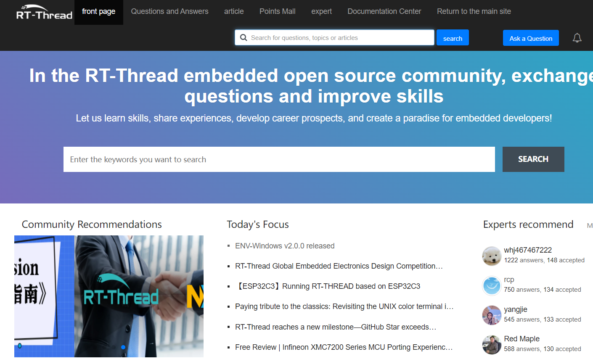

### RT-Thread Forum

The [RT-Thread embedded open source community forum](https://club.rt-thread.org/)is an online platform designed for developers to collaborate in addressing technical challenges, developing their professional skills, and sharing a wealth of educational resources, including tutorials, study notes, and project experiences. The platform fosters a vibrant community of technical exchange and knowledge-building.

During the development process, developers may encounter difficulties. In this forum, they can present their own problems and receive guidance on how to address them. Forums dedicated to specific fields of expertise facilitate the exchange of knowledge and expertise, enabling developers to find solutions to their problems.
Additionally, the forum offers the option of posting articles. This allows users to share their experiences and insights, including their approaches to problem-solving.