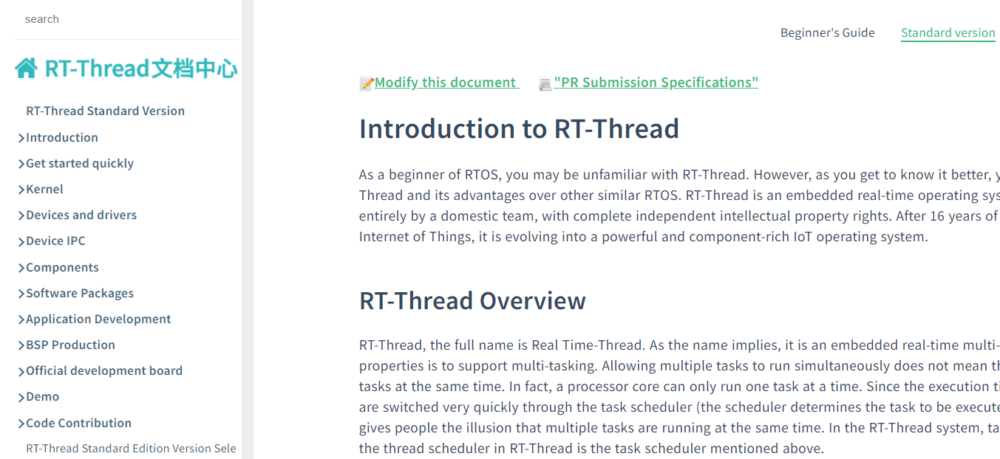

### RT-Thread Document Centre

The RT-Thread Documentation Centre is maintained by RT-Thread. The home page comprises five modules. The Documentation Centre contains a variety of resources, including a Beginner's Guide, the RT-Thread Standard Edition, the RT-Thread nano version, the RT-Thread Smart Edition, and Development Tools. It also provides comprehensive documentation on the RT-Thread kernel, components, device drivers, and software packages. This detailed information is presented in a way that allows developers to quickly understand the essentials of RT-Thread. Additionally, the Centre offers a Quick Start Guide, BSP production methods, and Demo examples. By studying these resources, developers can rapidly gain the knowledge required to begin working with RT-Thread.

