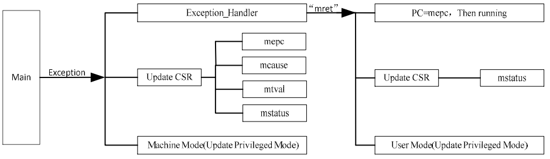

### RISC-V Interrupt Management Description

The RISC-V specification gives a typical external interrupt controller, PLIC, and a local interrupt controller, CLINT, which are usually implemented in a kernel-specific way. Therefore, in many commercial RISC-V chips, there are various kinds of interrupt managers, such as PFIC, CLIC, etc. Here we introduce the RISC-V interrupt management part based on the conventional implementation. In RISC-V interrupt management usually involves two kinds of interrupts, vector interrupts and non-vector interrupts. Next, we will introduce these two types of interrupt management in the 32-bit RISC-V processor to handle the exception, the following content are working in machine mode, so the registers involved are also in machine mode.

### Introduction to Exceptions

Generally speaking, the behaviour of interrupting the execution flow of a program due to incorrect program execution or the execution of an operation that is not allowed by the current CPU environment is called an exception, and the behaviour of pausing the execution flow of a program due to the reception of data by a user-configured serial port, for example, is called an interrupt.

Whether an exception or an interrupt is triggered in a system, the hardware behaviour of the processor is the same, suspending the current flow of program execution, switching to the exception or interrupt program for execution, and returning to the previous program to continue execution after the interrupt or exception is handled.

In the RISC-V specification, the behaviour of interrupts and narrow exceptions is uniformly classified as exceptions. A non-vectorised interrupt that triggers an interrupt or a narrow exception jumps to the same handler, where it looks up the relevant registers to determine whether the exception is an interrupt or a narrow exception. The difference between the vector interrupt management mode and the non-vector interrupt management mode is that the vector interrupt management mode will directly jump to the corresponding exception handler without the need to query the registers to find out the specific type of the triggered exception.

#### Setting the Exception Entry Address

The RISC-V specification defines a machine mode exception and address register (mtvec), which is usually assigned a value during the system startup phase, and the address of the function to be executed after the exception is triggered is loaded into this register. 32-bit processors usually require a 4-byte alignment for the address, so the lower 4 bits of the address of the function don't contain the address information, so the mtvec register is not used for the function. This allows the lower two bits of the mtvec register to be used for other functions. Typically, the lower two bits of the mtvec register are used to set the management mode of interrupts and other roles related to interrupt management.

Take the CH32V series as an example, bit0 is used to set whether to use vector mode or non-vector mode. bit1 is used to set whether to place the absolute address of the jump after the exception or the specific jump instruction in the vector table.

#### Query the cause of the exception

Adopting non-vector interrupt management mode, when an exception is triggered, it will jump into the unified exception handling function to execute, in this exception handling function, it is necessary to query the machine mode exception cause register (mcause), the highest bit of the mcause register is used to identify the type of the exception in the RISC-V specification, the position is to identify the triggered interrupt, and the position is 0, which indicates that the triggered exception is a narrowly-defined abnormality.

#### Exception Procedure Pointer Register

The RISC-V specification defines an exception program pointer register (mepc). This register is used to hold the program pointer when entering an exception or interrupt, its used to hold the instruction PC pointer prior to entering the exception when the exception is generated, and when the exception is handled, mepc is used as the return address for the exception return. Note that when a narrow exception occurs, mepc is updated to the PC value of the current instruction that generated the exception; when an interrupt occurs, mepc is updated to the PC value of the next instruction.

#### Exception Value Register

The RISC-V specification defines an exception value register (mtval), which is used to hold the value of the exception that caused the exception when it was thrown. Typically the behaviour of this register is as follows:
1. If the exception is caused by a memory access, the hardware stores the address of the memory access at the time of the exception in mtval.
2. If the exception is caused by an illegal instruction, the hardware stores the instruction code of the instruction in mtval.
3. If the exception is caused by a hardware breakpoint, the hardware will store the PC value at the breakpoint in mtval.
4. For other exceptions, the hardware will set the value of mtval to 0, for example, exceptions caused by ebreak, ecall instructions.  

### Triggering an exception

When the programme is running normally, if for some reason, it is triggered to enter an exception or interrupt. For different RISC-V processors, the implementation of registers related to interrupt is different, here we take Qinheng's barley series microcontroller as an example.

The hardware behaviour of the microprocessor at this time can be summarized as follows:  

(1) Suspend the current programme flow and turn to execute the exception or interrupt handling function. The entry base address and addressing mode of the exception or interrupt function are defined by the exception entry base address register mtvec. mtvec[31:2] defines the base address of the exception or interrupt function. mtvec[1:0] defines the addressing mode of the handler function. mtvec[0] defines the entry mode of the exceptions and interrupts, and when mtvec[0]=0, all the exceptions and interrupts use the unified entry, that is, when an exception or interrupt occurs, it turns to the base address defined by mtvec[31:2] to execute. Which type or interrupt belongs to exactly needs to be queried through the mcause register and handled separately; when mtvec[0]=1, exceptions and interrupts use the vector table mode, i.e., each exception and interrupt is numbered, the address is shifted according to the interrupt number*4, and the execution is shifted to the base address + interrupt number*4 defined by mtvec[31:2] when an exception or interrupt occurs. In vector mode, mtvec[1] defines the recognition mode of the vector table. When mtvec[1]=0, an instruction to jump to the exception or interrupt handler function is stored at the vector table, or it can be an other instruction; when mtvec[1]=1, the absolute address of the exception handler function is stored at the vector table .

(2) Update CSR Register
When entering an exception or interrupt, the microprocessor will automatically update the relevant CSR registers, including the machine mode exception cause register
mcause, machine mode exception pointer register mepc, machine mode exception value register mtval, and machine mode status register mstatus.

- Updating mcause
  As mentioned earlier, after entering an exception or interrupt, its value reflects the current exception type or interrupt number, and software can read this register to
  The software can read the value of this register to check the cause of the abnormality or judge the source of the interrupt, see Table 2-1 for details.
- Update mepc
  The standard definition of the return address of the microprocessor after exiting an exception or interrupt is stored in mepc. Therefore, when an exception or interrupt occurs, the hardware automatically updates the mepc value to
  hardware automatically updates the mepc value to the PC value of the current instruction that encountered the exception, or the PC value of the next pre-executed instruction before the interrupt. After the exception or interrupt is handled, the microprocessor uses its saved value as the return address to return to the interrupt location to continue execution.

It is worth noting, however:

- mepc is a readable and writable register, and software can also modify the value for the purpose of modifying the PC pointer location for the run after the return
  purpose.
- When an interrupt occurs, i.e., when mcause[31]=1, the value of mepc is updated to the PC value of the next unexecuted instruction at the time of the interrupt.
  When an interrupt occurs, i.e., mcause[31]=1, the value of mepc is updated to the PC value of the next unexecuted instruction at the time of interrupt. 

(3) Update mtval
When an exception is entered, the hardware will automatically update the value of mtval, for details, please refer to the description of the exception value register above. Update ( ) (4) mstatus
The hardware updates certain bits in mstatus when entering exceptions and interrupts:

- MPIE is updated to the value of the MIE before entering the exception and interrupt, and is used to restore the MIE after the exception and interrupt end.
- MPP is updated to the privileged mode before entering exceptions and interrupts, and after exceptions and interrupts end, MPP is used to restore the previous privileged mode.

(5) Updating the microprocessor privilege mode
When exceptions and interrupts occur, the microprocessor privilege mode is updated to the machine mode   

(6) Execution of Exception Handling Functions

- Upon entering an exception or interrupt, the microprocessor executes the program from the address and mode defined by the mtvec register. When unified entry is used, the microprocessor takes a jump instruction from the base address defined by mtvec[31:2], based on the value of mtvec[1], or gets the entry address of the exception and interrupt handler function, and goes to execution instead. At this time, the exception and interrupt handling function can judge whether the cause is an exception or an interrupt according to the value of mcause[31], and the type and cause of the exception or the corresponding interrupt can be judged by the exception code and handled accordingly. When using the base address + interrupt number * 4 for offset, the hardware automatically jumps to the vector table according to the interrupt number to get the entry address of the exception or interrupt function, and jumps to the execution.  

  ### Exit Exception

  After the completion of the exception or interrupt handler, it is necessary to exit from the service routine. After entering exceptions and interrupts, the microprocessor enters machine mode from user mode.
  The exception and interrupt handling is also done in the machine mode, when you need to exit the exception and interrupt, you need to use the mret
  instruction when it is necessary to exit exceptions and interrupts. At this time, the microprocessor hardware will automatically perform the following operations:

  - The PC pointer is restored to the value of CSR register mepc, i.e., execution starts from the instruction address saved by mepc. Note that the PC pointer is restored to the value of the CSR register mepc.
    The PC pointer is restored to the value of CSR register mepc, i.e., execution starts from the address of the instruction stored in mepc.
  - The CSR register mstatus is updated, MIE is restored to MPIE, and MPP is used to restore the previous privileged mode of the microprocessor.  

-   

