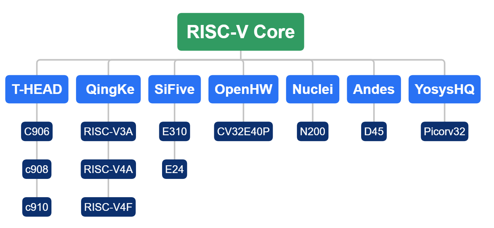
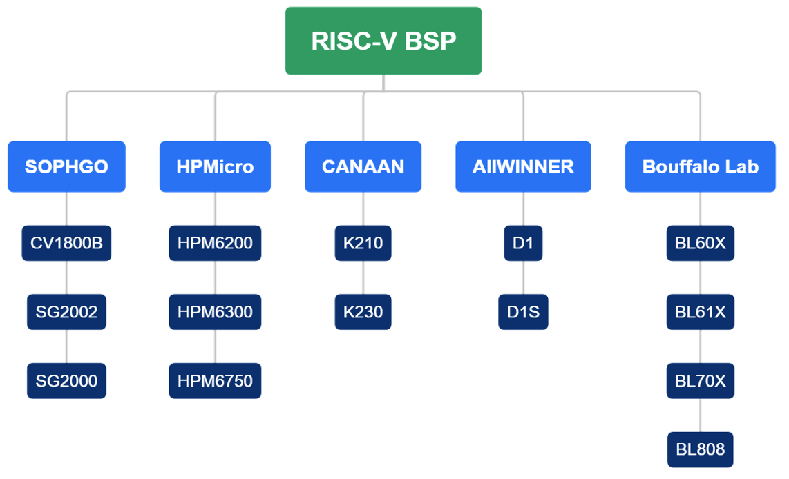
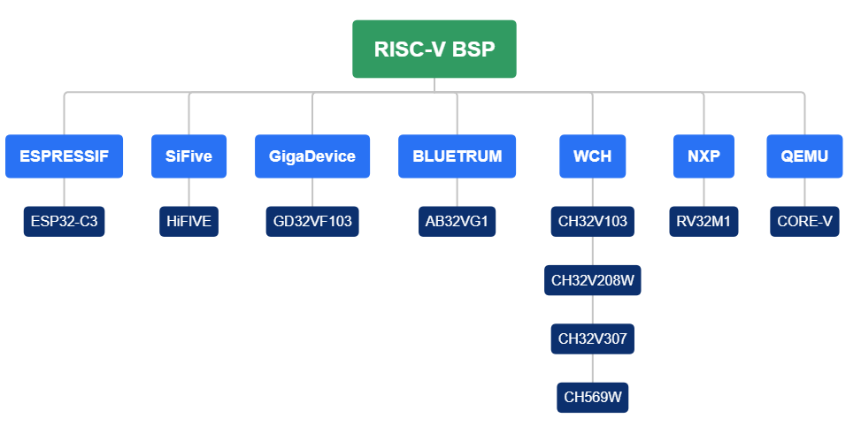

# RT-Thread支持的RISC-V内核

RT-Thread对RISC-V MCU具有非常丰富的支持，支持许多的RISC-V内核与芯片接下来我们介绍一下RT-Thread支持的RISC-V内核与芯片。

RT-Thread支持的RISC-V内核如下图所示：

RT-Thread支持的RISC-V芯片与板级支持包如下图所示：

上述就是RT-Thread支持的RISC-V内核与使用相应内核的芯片，同时RT-Thread针对这些芯片适配了完整的软件包，软件包实现了板子上大部分外设的驱动，用户可以直接使用相应的BSP，基于BSP定制自己的硬件方案进行开发。