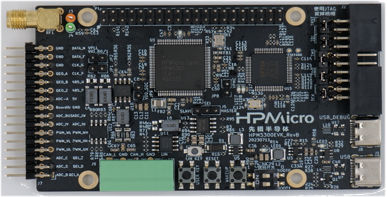
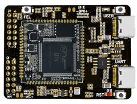
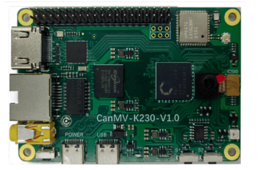

# RT-Thread支持的RISC-V开发板硬件

RT-Thread对市面上许多的RISC-V开发板做了支持，在RT-Thread仓库中有完善的BSP，用户根据BSP目录下的README说明文档便可以快速的将相应的RISC-V开发板跑起来，同时可以在开发板上体验RT-Thread。下述是RT-thread支持的部分RISC-V开发板：

开发板1：HPM6750

开发板2：HPM5300

开发板3：CH32V307

开发板4：HIFIVE

开发板5：D1S

开发板6：K230

开发板7：MILKV

