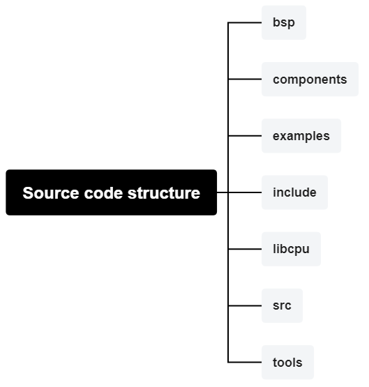

### RT-Thread project source code introduction

RT-Thread project code exists on both gitee and github, users can choose the specific code access method according to their own usage environment. [github project code access](https://github.com/RT-Thread/rt-thread) and [gitee project code access](https://gitee.com/rtthread/rt-thread), users who encounter problems or find bugs in the process of use can raise issues on the above platforms. Users who encounter problems or find bugs in the process of using RT-Thread can put forward issues in the above platform, and RT-Thread will respond in time.

### Project source code structure

The project source code structure is as follows:

`bsp directory`: this directory provides RT-Thread Demo projects for different MCUs.

`components directory`: this directory provides independent of the MCU functional modules, such as dfs, finsh, etc., as well as rt-thread device driver, a variety of abstraction layers.

`examples directory`: this directory provides examples of some components and most of the utest test cases, and most of the demos support msh commands.

`include directory`: this directory contains rt-thread header files.

`libcpu directory`: this directory contains the port files of various architectures supported by rt-thread, risc-v port files are in the risc-v subdirectory of this directory.

`src directory`: this directory contains the kernel source code of rt-thread, the various basic services provided by rt-thread come from this folder.

`tools`: this directory contains various python scripts for rt-thread system development, such as source code compilation and configuration.

