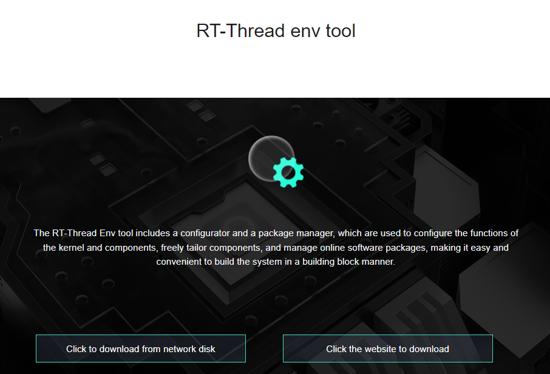
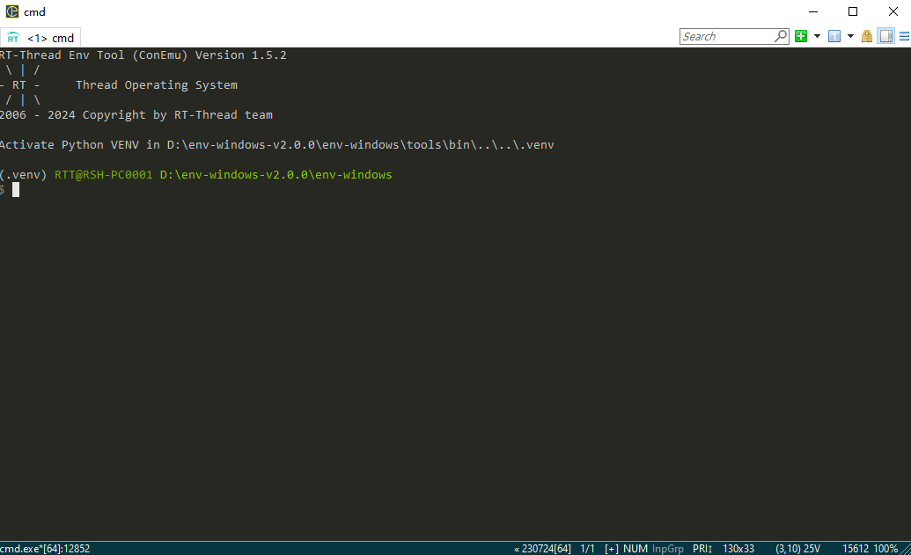
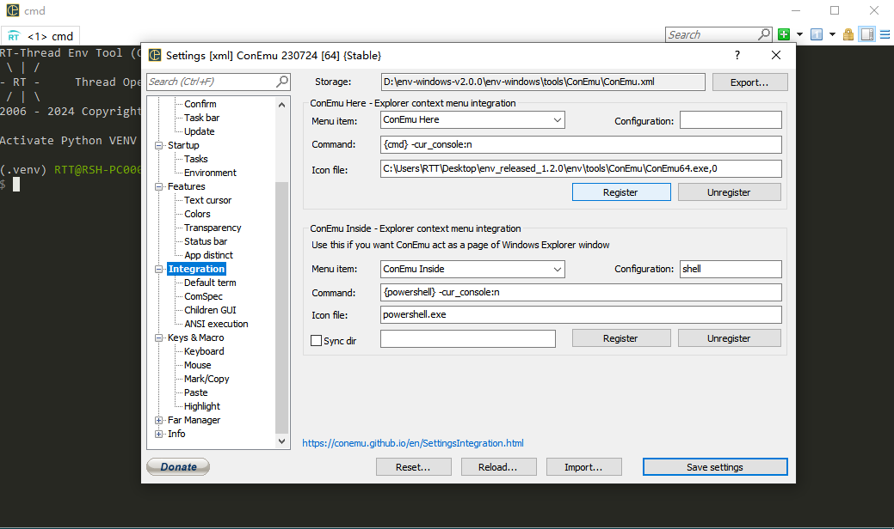
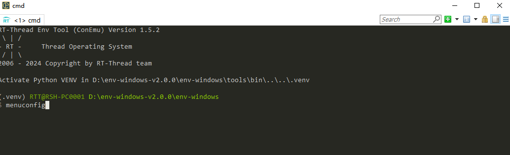
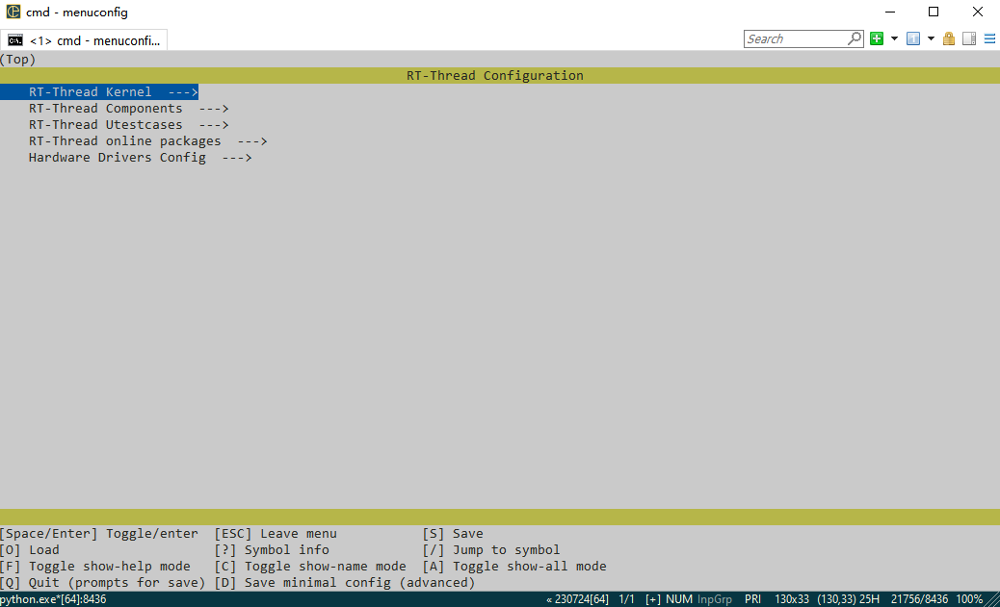
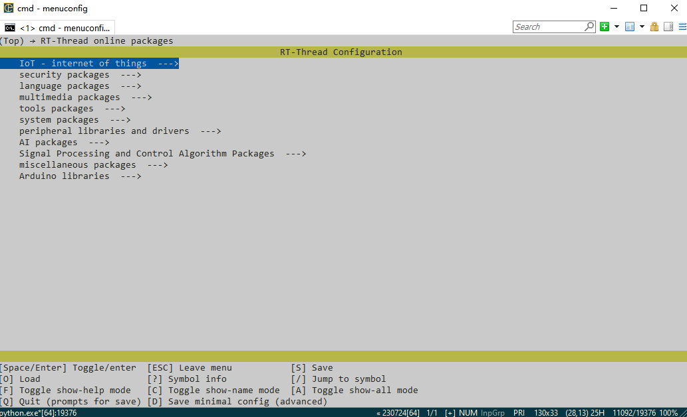

### ENV Tool Installation and Description

The RT-Thread Env tool includes a configurator and a package manager to configure the functionality of the kernel and components, to freely tailor components, and to manage online packages, making it easy to build the system in a building block fashion.



[ENV Tool Download Address 1](https://www.rt-thread.org/download.html)

[ENV Tool Download Address 2](https://github.com/RT-Thread/env)

### ENV tool configuration

Preparation:

- Install git on your computer, the package management function requires git support. git can be downloaded from `https://git-scm.com/downloads`, follow the wizard to install git correctly, and add git to the system environment variable.
- Note that in the working environment, all paths should not have Chinese characters or spaces.

Usage:

The RT-Thread package environment is mainly based on the command line console, and is assisted by a character-based interface, which makes it possible to set up the RT-Thread development environment in a way that minimises the need to modify configuration files. 

1. Click the env.exe file under the package.



2. Right click on the menu bar blank, select the setting option to appear in the following figure of the settings interface, select the Integration option, click the Register option to register env to the right-click option in the bsp directory right-click and select `ConEmu Here` option to open the env.



### ENV Tools - Compile

scons is the compilation and build tool used by RT-Thread, you can use scons related commands to compile RT-Thread.

1. After opening the console, you can use the cd command in command line mode to switch to the root directory of the BSP you want to configure.

   For example, the project directory is: `rt-thread\bsp\stm32f429-apollo`:


2. Env carries `Python & scons` environment, just run `scons` command in `rt-thread\bsp\stm32f429-apollo` directory, you can use the default ARM_GCC toolchain to compile the bsp, the result is as follows


If you are using mdk/iar for project development, you can use the project file in BSP directly or use one of the following commands to regenerate the project and then compile and download it.

```python
scons --target=iar
scons --target=mdk4
scons --target=mdk5
```

### ENV Tools - menuconfig Configuration

menuconfig is a graphical configuration tool that RT-Thread uses to configure and tailor the entire system.

The menuconfig configuration tool can be opened by executing the menuconfig command in env.



Result after executing the menuconfig command.



After selecting the configuration items, press the ESC key to exit and select Save Changes to automatically generate the rtconfig.h file. At this point, use the scons command again to recompile the project based on the new rtconfig.h file.

### ENV Tools - Package Management Configuration

RT-Thread provides a package management platform where official or developer-supplied packages are stored. This platform provides developers with a wide selection of reusable packages, which is an important part of the RT-Thread ecosystem. package tool, as part of Env, provides developers with the ability to manage packages by downloading, updating, and deleting packages, etc. The command profile can be seen by typing `pkgs` at the Env command line:

```shell
> pkgs
usage: env.py package [-h] [--update] [--list] [--wizard] [--upgrade]
                      [--printenv]

optional arguments:
  -h, --help  show this help message and exit
  --update    update packages, install or remove the packages as you set in
              menuconfig
  --list      list target packages
  --wizard    create a package with wizard
  --upgrade   update local packages list from git repo
  --printenv  print environmental variables to check
```

Before downloading or updating packages, you need to open the desired packages in `menuconfig`, which is located under the `RT-Thread online packages` menu, and then you can see the following package categories:



Find the package you need and select it to turn it on, save and exit menuconfig. At this point, the package has been marked as selected, but it has not been downloaded locally, so it cannot be used yet.

- **Download** : If the package has been selected locally but not downloaded, type `pkgs --update` and the package will be downloaded automatically;
- **Update** : If the selected package has been updated on the server, and the version number selected is latest. Type `pkgs --update` and the package will be updated locally;
- **DELETE** : If a package is not needed, uncheck it in menuconfig and then run: `pkgs --update`. The package will be deleted if it was downloaded locally but not selected.

Tip: What is the difference between pkgs --upgrade and pkgs --update?

1. pkgs --upgrade command is used to upgrade the Env function script itself and the package list. Without an up-to-date package list you cannot select a recently updated package.
2. pkgs --update command is used to update the package itself. For example, you selected the packages of json and mqtt in menuconfig, but these packages are not downloaded when you exit menuconfig. You need to use the pkgs --update command, then Env will download the selected packages and add them to your project.
3. The new version of Env supports menuconfig -s/--setting command, if you don't want to use pkgs --update command every time you change packages, you can configure Env to update packages automatically after using menuconfig after using menuconfig -s/--setting command.

The above is the detailed usage of rt-thread env tool.

