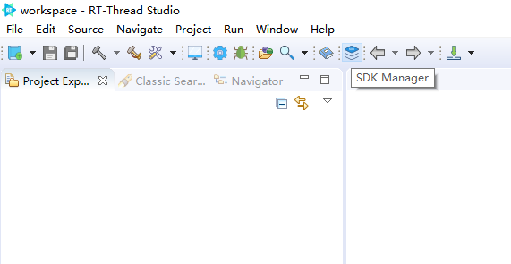
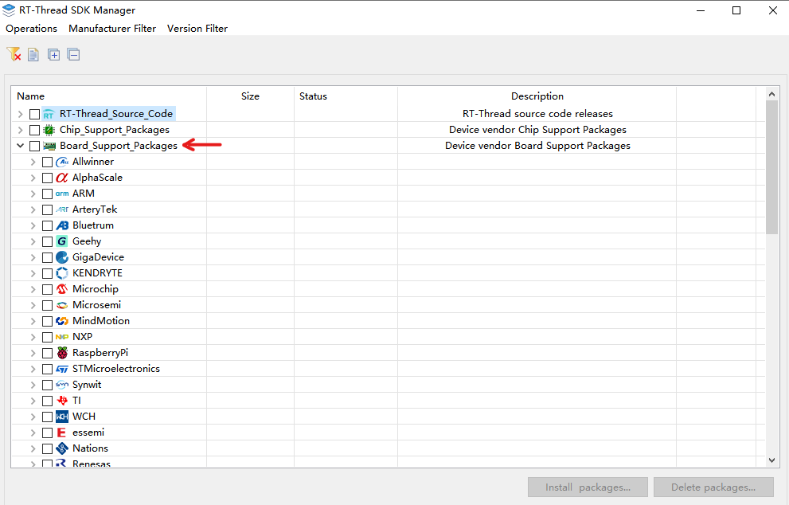
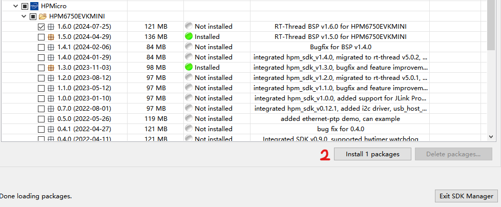
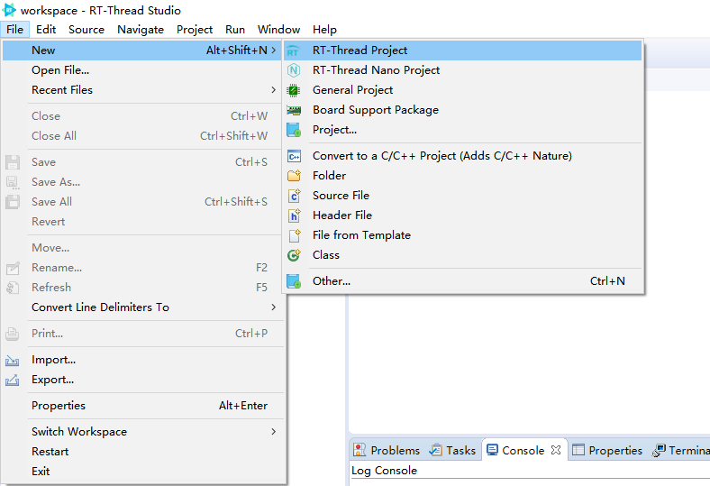
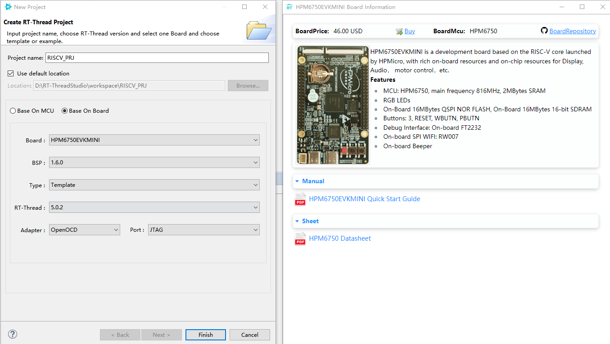
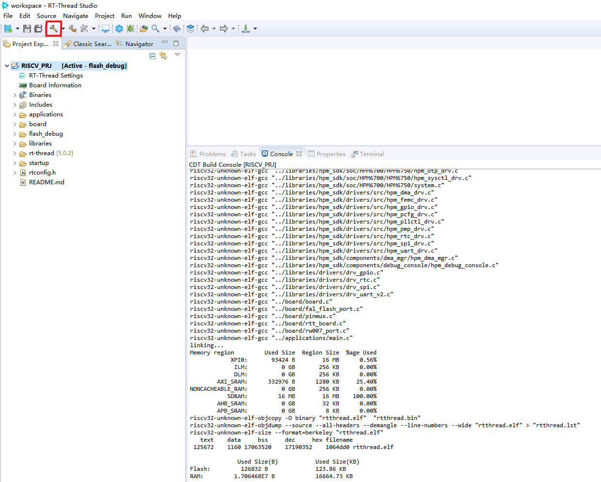
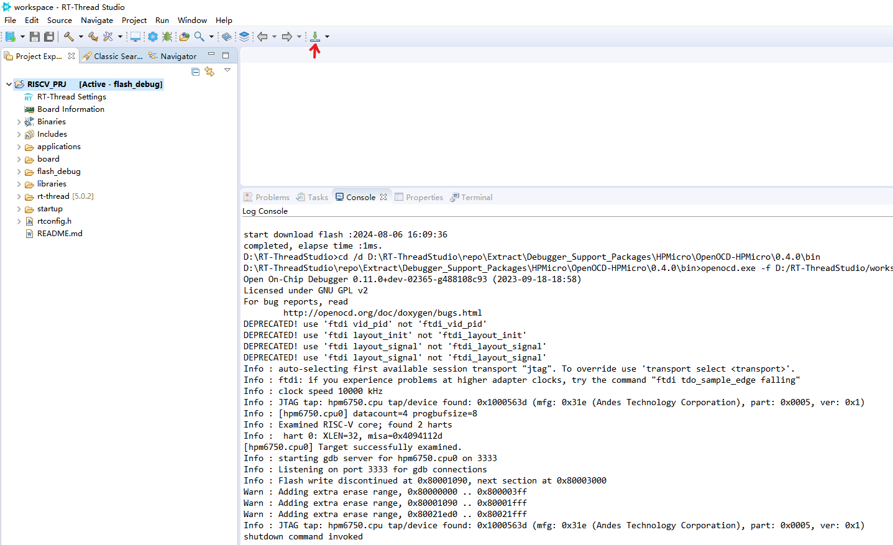

### RT-Studio Development RT-Thread Description

RT-Studio supports a very large number of Board Support Packages (BSPs), users can choose the BSP corresponding to their chip platform and quickly run RT-Thread on their platform.

The topic of this course is RISC-V, HPM6750 is a RISC-V architecture chip, RT-Thread has perfect support for this BSP, here we take the BSP of this chip as an example to create a sample project to run RT-Thread on a RISC-V chip.

### Install the BSP support package

Firstly install RT-Studio, [RT-Studio download address](https://www.rt-thread.org/download.html). After completing the software installation, open RT-Studio and click on the Package Manager option in the menu bar. You can see `SDK Manager` option in the menu bar, select this option.

Find the `Board_Support_Package` option in Options as shown below:

Select HPMicro and choose one of the versions to download, usually the latest version will do, here tick the latest version and click on the `Install packages` option to install the packages required for this tutorial.

### Create a project

Once the installation is complete, click on the `File` option and select the `New`->`RT-Thread Project` option to create an RT-Thread project.

Below is a sample project we created based on the HPM6750:

In the above figure, first of all, you need to find HPM6750EVKMINI in the Board option, drop down, BSP option is used to select the version of the BSP, here choose the latest version can be, and finally, you need to set the name of the project, in the `Project name` option to set the name of the project, set the completion of the project creation by clicking on the `Finsh` option.

### Compile the project

After creating the project, click on the red box in the figure below to compile it, and it will be compiled successfully as shown in the figure below:

### Burn Firmware

Click on the download option on the right to burn the firmware into the MCU, the burn result is shown below:

### Debugging Project

After completing the compilation and download of the project, we can click on the following debugging options to enter the debugging, debugging method is the same as eclipse.

