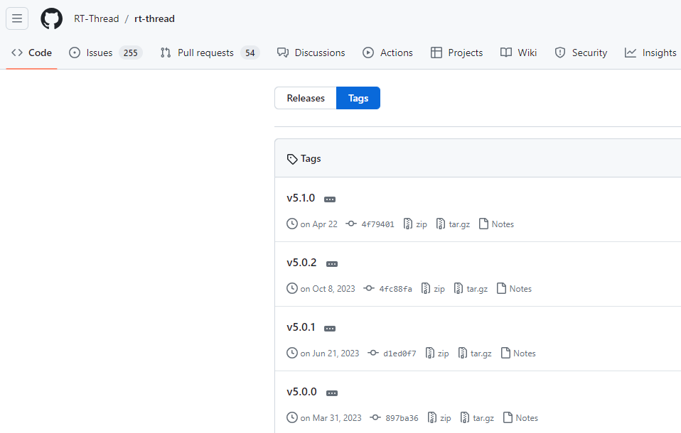
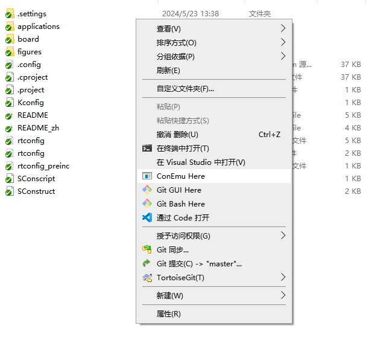
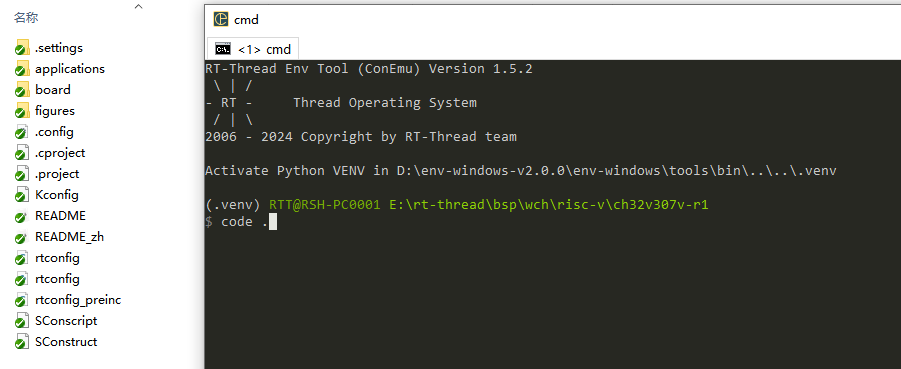
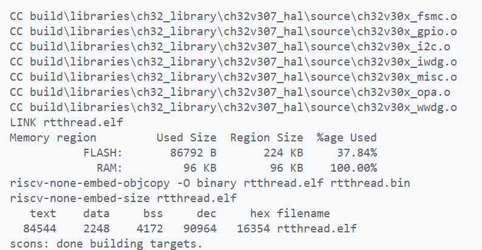
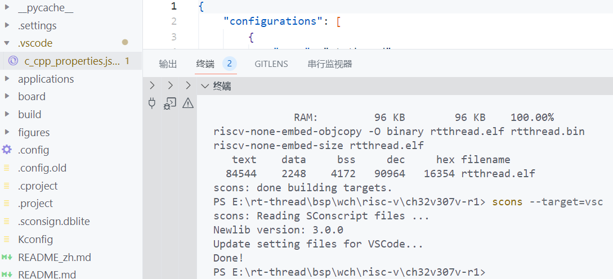
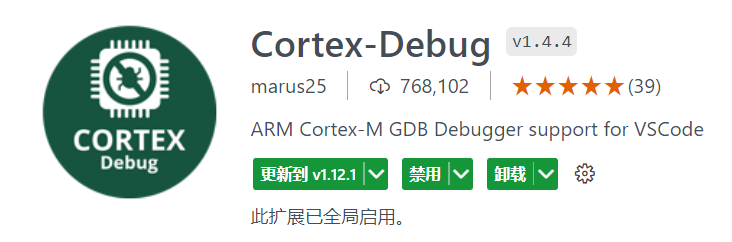
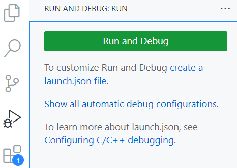
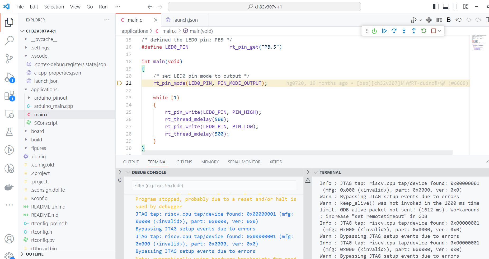

# VSCode+ENV开发RT-Thread说明

VSCode（Visual Studio Code）是微软开发的跨平台免费源代码编辑器。用户可以通过内置的扩展程序商店安装扩展，以拓展其功能。

Env 是 RT-Thread 推出的开发辅助工具，针对基于 RT-Thread 操作系统的项目工程，提供编译构建环境、图形化系统配置及软件包管理功能。其内置的 menuconfig 提供了简单易用的配置剪裁工具，可对内核、组件和软件包进行自由裁剪，使系统以搭积木的方式进行构建。

VSCode与ENV相结合便可以实现类似集成开发环境的感觉，相比于集成开发环境，VSCode+ENV的开发方式更加灵活，但这种方式对用户的要求也会变高。

CH32V307是一款RISC-V架构的芯片，同时该RT-Thread仓库对该芯片拥有板支持包（BSP），RT-Thread对该BSP做了非常丰富的支持，用户可以在此基础上修改创建符合自己硬件平台的BSP。接下来我们以该BSP为例搭建编译调试环境。

在开始下一步前用户需要自行安装VSCode软件。

# 源码获取

在开发之前首先需要获取RT-Thread源码， 用户可以直接克隆[主线的工程](https://github.com/RT-Thread/rt-thread)源码或者下载[指定发布版本](https://github.com/RT-Thread/rt-thread/tags)的源码。部分发布版本如下：



通常在使用时推荐使用最新的发布版本，最新的发布版本会修复上一个版本反馈的bug并引入新的特性。

# BSP配置

首先进入BSP的applications同级目录下，然后右键选择ConEmu Here选项打开env工具。



在env中输入code，按方向键右键补全，最后按回车进入VSCode开发环境。



使用该方式打开BSP后，用户可以在终端中使用scons命令进行编译，编译之前首先需要设置我们使用的工具链的路径。该bsp的[工具链](http://www.mounriver.com/download)可以在官方提供的MounRiver Studio软件中获取。

准备好工具链后，当前我的工具链所在的路径为`D:\RT-ThreadStudio\repo\Extract\ToolChain_Support_Packages\WCH\RISC-V-GCC-WCH\8.2.0\bin `，我们使用如下命令设置工具链的路径，用户在将工具链的路径替换为自己的即可，这样子在执行scons编译时便可以找到工具链的路径：

```shell
set RTT_EXEC_PATH=D:\RT-ThreadStudio\repo\Extract\ToolChain_Support_Packages\WCH\RISC-V-GCC-WCH\8.2.0\bin 
```

设置工具链的路径完成后，执行scons编译，编译结果如下：



# VSCode配置

在上述打开的env工具的输入框中输入如下命令，生成VSCode工程所需要的配置文件

```shell
scons --target=vsc
```

执行上述命令后，在工程目录下生成了.vsciode目录，该目录下存在一个json文件，该文件的作用是在调试时可以找到代码的路径。



一个完善的工程除了具有编译下载的功能，调试功能也是必不可少的一部分， 因此我们需要添加工程的调试功能，该调试功能依赖VSCode上非常受欢迎的一个调试插件，`Cortex-Debug`，该插件在VSCode的应用商店进行安装，该组件的v1.4.4版本对RISC-V工具链支持较好，所以推荐使用v1.4.4版本的`Cortex-Debug`。



点击左侧的Debug选项，选择创建lunch.json文件，用于设置调试所需配置。



生成的默认lunch.json文件如下：

```json
{
    // Use IntelliSense to learn about possible attributes.
    // Hover to view descriptions of existing attributes.
    // For more information, visit: https://go.microsoft.com/fwlink/?linkid=830387
    "version": "0.2.0",
    "configurations": [
        {
            "name": "Cortex Debug",
            "cwd": "${workspaceFolder}",
            "executable": "./bin/executable.elf",
            "request": "launch",
            "type": "cortex-debug",
            "runToEntryPoint": "main",
            "servertype": "jlink"
        }
    ]
}
```

修改生成的lunch.json文件。

```json
{
    // Use IntelliSense to learn about possible attributes.
    // Hover to view descriptions of existing attributes.
    // For more information, visit: https://go.microsoft.com/fwlink/?linkid=830387
    "version": "0.2.0",
    "configurations": [
        {
            "name": "RISCV Debug",
            "cwd": "${workspaceFolder}",
            "executable": "${workspaceFolder}\rtthread.elf",
            "request": "launch",
            "type": "cortex-debug",
            "runToEntryPoint": "main",
            "servertype": "openocd",
            "serverpath": "D:WCH/WCH-LINK_Debugger/1.0.4/OpenOCD/bin/openocd",
            "configFiles": [
                "D:WCH/WCH-LINK_Debugger/1.0.4/OpenOCD/bin/wch-riscv.cfg"
              ],
            "toolchainPrefix": "WCH/RISC-V-GCC-WCH/8.2.0/bin/riscv-none-embed"
        }
    ]
}
```

"name"：字段修改为"RISCV Debug"

"executable"：字段修改为编译生成的rtthread.elf的路径

"servertype"：字段修改为"openocd"

"serverpath"：字段配置为用户openocd的路径

"configFiles"： 字段配置为ch32使用的openocd配置文件

"toolchainPrefix"：字段配置为GCC工具链的路径

完成上述配置后，按`F5`或`Fn+F5`启动调试，调试界面如下：



启动调试后同样会将程序下载至芯片。

上述操作过程同样适用于RT-Thread仓库下的其他risc-v bsp，用户根据自己的需求按照上述步骤修改便可以实现使用VSCode+ENV的方式开发其他BSP。