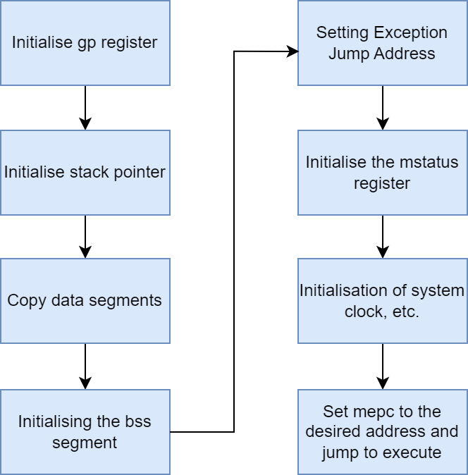

# RISC-V启动流程说明

RISC-V MCU的启动流程也是非常简单易懂的，这里以常规的RISC-V MCU的启动流程展开介绍。常规的启动过程会涉及存储介质的数据拷贝，模式配置与系统的一些初始化。

接下来我们将介绍在RISC-V启动过程中必不可少的几个操作:

## 1.初始化gp全局指针寄存器

在启动阶段会执行一段下述的代码：

```assembly
	la gp, __global_pointer$
```

代码中的__global_pointer$符号来自于启动文件，示例如下：

```livescript
	.data :
	{
    	*(.gnu.linkonce.r.*)
    	*(.data .data.*)
    	*(.gnu.linkonce.d.*)
		. = ALIGN(8);
    	PROVIDE( __global_pointer$ = . + 0x800 );
    	*(.sdata .sdata.*)
		*(.sdata2.*)
    	*(.gnu.linkonce.s.*)
    	. = ALIGN(8);
    	*(.srodata.cst16)
    	*(.srodata.cst8)
    	*(.srodata.cst4)
    	*(.srodata.cst2)
    	*(.srodata .srodata.*)
    	. = ALIGN(4);
		PROVIDE( _edata = .);
	} >RAM AT>FLASH
```

我们可以看到在数据段中定义了该符号。在介绍该寄存器的作用时我们需要介绍一个编译技术：链接器松弛；跳转并链接指令中的相对地址域位宽为20，因此一条指令就足够跳到很远的相对地址域。通常编译器为每个外部函数跳转都生成了两条指令，很多情况下单条指令即可满足。从两条指令到一的优化同时节省间和空开销， 因此链接器会扫描几遍代码尽可能地把两条指令替换为一条。从而使函数和调用它的位置之间距离缩短，链接器进行多次扫描替换，直至代码不再改变。这个过程称为链接器松弛。

对于 gp指针 ±2KiB范围内的数据访问，编译加入 `-msmall-data-limit=n` 参数，有了这个参数，编译器会把内存空间小于 n 字节的静态变量放入 `.sdata` 或者 `.sdata.*` 节，然后链接器将这部分静态变量集中在 `__global_pointer$` +/- 2K 的范围内。

这样对于 gp指针 ±2KiB范围内的数据访问， RISC-V链接器会使用全局指针寄存器中的指针替换掉 lui和 auipc两条指令。

## 2.初始化栈指针

示例代码如下：

```assembly
	la sp, _eusrstack 
```

完成上述操作后，系统中的压栈与出栈将在sp寄存器中 的指针指向的地址空间进行。

## 3.数据段拷贝与BSS段初始化

和其他架构的一样，在系统启动阶微控制器需要将数据段拷贝至RAM，同时在RAM中进行未初始化的全局变量的初始化。

下述汇编代码是该过程的实现：

```assembly
2:
	/* Load data section from flash to RAM */
	la a0, _data_lma
	la a1, _data_vma
	la a2, _edata
	bgeu a1, a2, 2f
1:
	lw t0, (a0)
	sw t0, (a1)
	addi a0, a0, 4
	addi a1, a1, 4
	bltu a1, a2, 1b
2:
	/* Clear bss section */
	la a0, _sbss
	la a1, _ebss
	bgeu a0, a1, 2f
1:
	sw zero, (a0)
	addi a0, a0, 4
	bltu a0, a1, 1b
```

上述代码中的 `_data_lma`  ,`_data_vma`等符号来自于链接脚本，链接脚本是对我们代码在内存中的布局的设置，以下是上述符号在链接脚本的位置。

```
	.dalign :
	{
		. = ALIGN(4);
		PROVIDE(_data_vma = .);
	} >RAM AT>FLASH	

	.dlalign :
	{
		. = ALIGN(4); 
		PROVIDE(_data_lma = .);
	} >FLASH AT>FLASH

	.data :
	{
    	*(.gnu.linkonce.r.*)
    	*(.data .data.*)
    	*(.gnu.linkonce.d.*)
		. = ALIGN(8);
    	PROVIDE( __global_pointer$ = . + 0x800 );
    	*(.sdata .sdata.*)
		*(.sdata2.*)
    	*(.gnu.linkonce.s.*)
    	. = ALIGN(8);
    	*(.srodata.cst16)
    	*(.srodata.cst8)
    	*(.srodata.cst4)
    	*(.srodata.cst2)
    	*(.srodata .srodata.*)
    	. = ALIGN(4);
		PROVIDE( _edata = .);
	} >RAM AT>FLASH

	.bss :
	{
		. = ALIGN(4);
		PROVIDE( _sbss = .);
  	    *(.sbss*)
        *(.gnu.linkonce.sb.*)
		*(.bss*)
     	*(.gnu.linkonce.b.*)		
		*(COMMON*)
		. = ALIGN(4);
		PROVIDE( _ebss = .);
	} >RAM AT>FLASH
```

## 4.机器工作模式与异常地址设置

系统在正式启动前 必须要明确设置机器的工作模式，risc-v架构的工作模式由控制状态寄存器mstatus设置，同时该寄存器还会涉及FPU，全局中断的配置。

配置该寄存器的汇编代码如下：

```assembly
   	li t0, 0x7800
   	csrw mstatus, t0
```

RISC-V的中断控制器通常会支持向量中断与非向量中断，具体在工作中使用哪种工作方式取决于芯片实现中配置中断管理模式的寄存器的实现，这里我们只介绍当系统触发异常后跳转执行的基础地址，在RISC-V中异常与中断被统一称为异常。

当系统被配置为向量管理模式，则异常基地址寄存器(mtvec)中存放的是向量表的基地址；当系统被配置为非向量管理模式，则异常基地址寄存器(mtvec)中存放的是异常后的统一处理函数；

配置该寄存器的汇编代码如下：

```assembly
 	la t0, _vector_base
    ori t0, t0, 3           
	csrw mtvec, t0
```

## 5.自定义配置

risc-v架构规范允许芯片设计者自定义寄存器，通过配置这些寄存器可以配置芯片的一些自定义功能，比如指令预测，硬件压栈等操作，以下是配置自定义寄存器的一些示例代码：

```assembly
/* Configure pipelining and instruction prediction */
    li t0, 0x1f
    csrw 0xbc0, t0

/* Enable interrupt nesting and hardware stack */
	li t0, 0x1f
	csrw 0x804, t0
```

上述代码中的0xbc0与0x804是自定以寄存器的编号。

## 6.加载设置

完成上述配置后，通常会执行系统时钟的初始化等配置，然后给mepc寄存器赋值，在执行mret指令后会将mepc寄存器的值赋值给pc寄存器，系统将跳转至pc寄存器中指针指向的地址执行，同时还会将mstatus寄存的配置进行加载让系统工作在用户配置的模式下。

上述便是RISC-V架构的芯片的整体的启动流程。

# RISC-V启动流程图



