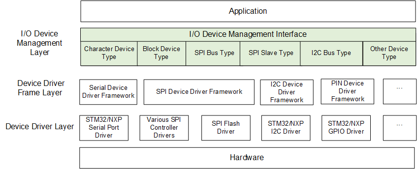
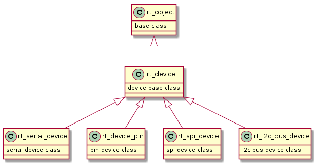

### RT-Thread Device Driver Programming

Most embedded systems contain some I/O devices, such as displays on instruments, serial communication, Ethernet devices, etc. RT-Thread provides an I/O device management layer to facilitate the management of these devices. In order to facilitate the management of these devices, RT-Thread provides an I/O device management layer, if the user adapts the I/O devices used in his system to the I/O device management layer of RT-Thread, and uses the device management layer API to write the application code, it will reduce the coupling between the user's code and the hardware device to a great extent, but of course, it will also increase some of the storage overhead.

For simple devices, the device driver interface can be directly registered to the I/O device management layer, but for some feature-rich devices RT-Thread will abstract the same type of device for specific devices, such as serial devices, different hardware platforms will have different serial peripherals, for these serial peripherals common characteristics of the abstraction of the specific device driver framework layer.

In summary, there are two ways to manage the device registration of RT-Thread as follows:

Simple device registration process

```shell
Device Drivers -> I/O Device Management
```

Complex Equipment Registration Process

```shell
Device Driver -> Device Driver Framework Layer -> I/O Device Management Layer
```

After completing the registration of the device using any of the above methods, the device can be operated using the upper layer of the I/O device management framework. From the above two ways we can see that the device driver for different hardware platforms are different, the device driver framework layer and the I/O device management layer for all platforms is the same, so if you use the I/O device management layer to replace the direct use of the underlying driver will greatly reduce the degree of coupling between the application and the underlying driver, but also increase the storage overheads, from the neat point of view, for the larger capacity of the device In addition, the use of RT-Thread device management framework will reduce the coupling of the code to improve the readability of the program.

In our understanding of the role of the device driver framework, and then take a detailed look at the RT-Thread I/O device model framework:



From the above figure, you can clearly see that the I/O device management is divided into 3 layers, from top to bottom, they are I/O device management layer, device driver framework layer, and device driver layer. The application obtains the correct device driver through the I/O device management interface, and then interacts with the underlying I/O hardware devices through this device driver. the I/O device management layer implements the encapsulation of the device driver. The application programme accesses the underlying device through the standard interface provided by the ‘I/O device management layer’ in the diagram, and upgrades and replacements of the device driver do not affect the upper layer application. This approach makes the hardware operation of the device code can exist independently of the application, the two sides only need to focus on the implementation of their respective functions, thus reducing the code coupling, complexity, and improve the reliability of the system.

RT-Thread adopts an object-oriented management approach, using inheritance for specific device types to implement the control blocks at each level. Next we look at the RT-Thread each device type control block inheritance relationship, the schematic is as follows:



From the above figure, we can see that the bottom level of the device driver control block gets the object of RT-Thread's rt_object type, which is the base of RT-Thread's control block type, and the second level is the control block of the device type that we are going to introduce, in line with threads, IPCs, etc., the device is at the same level with these control block types, and the difference with the thread object is that, for the device object, there are various specific device types under the device object type, which are inherited from the second layer of device types, and add their own device type's proprietary attributes on top of the device type.

The reason for adding the third layer is that for specific device objects, some device objects are more complex, if directly adapted to register when the I/O device framework layer, then the adaptation of different devices is still more complex, specific to a specific device type, such as serial port, the device itself is different on different platforms, but for the serial port, the device's behaviour on various platforms is the same. So under the device framework layer, for some complex devices, the public behaviour of the same type of device can be further abstracted out, and this part of the abstraction is the device driver framework layer, with the device driver framework layer, compared to directly adapting to the I/O device framework layer will reduce the workload.

Next, we will first introduce RT-Thread's device framework layer, and use a very simple example to illustrate the use of T-Thread's device framework layer. As we mentioned above, any device driver that interfaces to RT-Thread can use the topmost device management framework APIs to manipulate the underlying physical devices. Let's look at the I/O device management layer APIs in more detail.

### I/O Management Framework Usage

Here's how to first create a device I/O control block in RT-Thread using the I/O Management Framework:

```c
rt_device_t rt_device_create(int type, int attach_size);
```

The first parameter is the type of device: the type of device supported by RT-Thread;

The second parameter is the type of the device: the size of the user data;

Return value: the handle of the created device;

When calling this function, the system will dynamically allocate a device control block from the heap, the size of which is the sum of struct rt_device and attach_size, and the user can call rt_device_destroy to destroy the device when it is not in use.

After completing the creation of the device, the device is only a separate device, not in the system management, there is an object management container in RT-Thread, only the creation of the device can be registered to the object management container, the device is mounted to the object management container through the chain table, so that we can use the name of the rt_device_find to find the device created. The following section describes the above mentioned functions in turn.

```c
void rt_device_destroy(rt_device_t device);
```

The first parameter is the handle of the device;

Next is the function that registers the device with the object manager:

```c
rt_err_t rt_device_register(rt_device_t dev,
                            const char *name,
                            rt_uint16_t flags);
```

The first argument is the handle of the device;

The second parameter is the name of the device: when expecting to operate the device, use rt_device_find to find the device handle by name;

The third parameter is the attributes of the device;

Before registering the device, we need to register the I/O management functions required by the device to the created device, so that the device can be operated by the device management handle function after registration. For example, the following way:

```c
rt_device_t test_dev = rt_device_create(RT_Device_Class_Char, 0);

test_dev->init    = drv_test_init;
test_dev->open    = drv_test_open;
test_dev->close   = drv_test_close;
test_dev->read    = drv_test_read;
test_dev->write   = drv_test_write;
test_dev->control = drv_test_control;
```

The opposite of registering a device is unregistering it:

```c
rt_err_t rt_device_unregister(rt_device_t dev);
```

Unregistering a device removes the current device from the object manager.

Once the device is registered, we can use the functions in the I/O device management framework to manipulate the device.

We can use rt_device_find to find the device's handle by name, as shown in the following diagram:

```c
rt_device_t rt_device_find(const char *name)
```

The first parameter is the name of the device;

Firstly the device needs to be initialised by calling rt_device_init, the API is as follows:

```c
rt_err_t rt_device_init(rt_device_t dev);
```

The first parameter is the handle of the device: calling this API can initialise the device.

After completing the initialisation of the device, you can call the device's open function rt_device_open to open the device, when opening the device will also check whether the device is initialised or not, if the device is not initialised then the device will be initialised first, with the initialisation of the device API is different, in the docking device driver is usually the initialisation part of the device in the initialisation function rt_device_ init, and the actual enablement is implemented in rt_device_open. This call rt_device_init has the conditions for work, but the actual work of the device needs to use rt_device_open to enable.

The function to open the device is as follows:

```c
rt_err_t rt_device_open(rt_device_t dev, rt_uint16_t oflags);
```

The first parameter is the handle of the device;

The second parameter is the open mode flag of the device, according to which different behaviours are performed in the function to open the device.

Corresponding to the open device is the function rt_device_close, which is as follows:

```c
rt_err_t rt_device_close(rt_device_t dev)
```

Call the function will close the device, close the device will disable the device, the hardware device can not be used again, re-use need to re-open.

When you open the device can be used to operate some of the functions of the device, such as reading and writing to the device, first of all, we look at the read function of the device:

```c
rt_size_t rt_device_read(rt_device_t dev, rt_off_t pos,void* buffer, rt_size_t size);
```

The first parameter is the handle of the device;

The second parameter is the offset of the device, the parameter is more with different devices have different meanings;

The third parameter is the device buffer, used to read data from the device and stored in the buffer, the maximum length of the buffer is size.

Next, we seem to introduce the device write function:

```c
rt_size_t rt_device_write(rt_device_t dev, rt_off_t pos,const void* buffer, rt_size_t size);
```

The first parameter is the handle of the device;

The second parameter is the offset of the device, this parameter has different meanings with different devices;

The third parameter is the buffer of the device, which is used to place the data to be written;

The fourth parameter is the size of the data to be written;

In addition, there are control functions for device operation, the control function is as follows:

```c
rt_err_t rt_device_control(rt_device_t dev, rt_uint8_t cmd, void* arg);
```

The first parameter is the handle of the device;

The second parameter is the control command;

The third parameter is the command parameter;

The above detailed introduction of RT-Thread's I/O device management framework, the next step is to introduce RT-Thread with a practical example of the use of I/O device management framework, the following is the sample code:

```c
#include <rtthread.h>
#include <rtdevice.h>
#include "rtt_board.h"

static rt_err_t drv_test_init(rt_device_t dev)
{
    rt_kprintf("Test drv init!\n");
    return RT_EOK;
}

static rt_err_t drv_test_open(rt_device_t dev, rt_uint16_t oflag)
{
    rt_kprintf("Test drv open flag = %d.\n", oflag);
    return RT_EOK;
}

static rt_err_t drv_test_close(rt_device_t dev)
{
    rt_kprintf("Test drv close!\n");
    return RT_EOK;
}

static rt_ssize_t drv_test_read(rt_device_t dev, rt_off_t pos, void *buffer, rt_size_t size)
{
    rt_kprintf("Test drv read pos = %d, size = %d.\n", pos, size);
    return size;
}

static rt_ssize_t drv_test_write(rt_device_t dev, rt_off_t pos, const void *buffer, rt_size_t size)
{
    rt_kprintf("Test drv write pos = %d, size = %d.\n", pos, size);
    return size;
}

static rt_err_t drv_test_control(rt_device_t dev, int cmd, void *args)
{
    rt_kprintf("Test drv control cmd = %d.\n", cmd);
    return RT_EOK;
}

int rt_drv_test_init(void)
{
    rt_device_t test_dev = rt_device_create(RT_Device_Class_Char, 0);
    if(!test_dev)
    {
        rt_kprintf("Test drv create failed!\n");
        return -RT_ERROR;
    }

    test_dev->init    = drv_test_init;
    test_dev->open    = drv_test_open;
    test_dev->close   = drv_test_close;
    test_dev->read    = drv_test_read;
    test_dev->write   = drv_test_write;
    test_dev->control = drv_test_control;

    if(rt_device_register(test_dev, "test_drv", RT_DEVICE_FLAG_RDWR) != RT_EOK)
    {
        rt_kprintf("Test drv register failed!\n");
        return -RT_ERROR;
    }

    return RT_EOK;
}
INIT_BOARD_EXPORT(rt_drv_test_init);

static int drv_sample(void)
{
    rt_device_t test_dev = rt_device_find("test_drv");
    if(test_dev == RT_NULL)
    {
        rt_kprintf("Can not find test drv!\n");
        return -RT_ERROR;
    }

    // Initialising a device
    rt_device_init(test_dev);
    // Open Device
    rt_device_open(test_dev, RT_DEVICE_OFLAG_RDWR);
    // Control Device
    rt_device_control(test_dev, RT_DEVICE_CTRL_CONFIG, RT_NULL);
    // Write data to the device
    rt_device_write(test_dev, 100, RT_NULL, 1024);
    // Read data from device
    rt_device_read(test_dev, 20, RT_NULL, 128);
    // Turn off the device
    rt_device_close(test_dev);
    // Unregistered device
    rt_device_unregister(test_dev);
    // Destruction device
    rt_device_destroy(test_dev);

    return RT_EOK;
}
MSH_CMD_EXPORT(drv_sample, enable test drv sample);
```

1. The above example is a device that we built artificially, which has no real meaning only for testing RT-Thread's I/O device management framework.

   The first is the implemented I/O device operation methods, which are as follows:

   - drv_test_init
   - drv_test_open
   - drv_test_close
   - drv_test_read
   - drv_test_write
   - drv_test_control

   The above functions correspond to the operation methods in RT-Thread's I/O device management framework. Before registering the above devices into the object manager, the I/O device operation methods of the devices need to be initialised to the specific methods mentioned above, and then the devices can be registered into the object manager.

   After completing the registration of the device, the user can use the rt_device_find function in combination with the name of the device to find the handle of the device from the object manager, so as to use the object's operation function to operate the object.

   After completing the registration of the device, the user can use RT-Thread's I/O device management framework as follows

   1. find the handle of the device using the rt_device_find function
   2. use rt_device_init to initialise the device
   3. use rt_device_open to open the device, this step will operate on the device's reference count and other attributes, as well as the device's data sending and receiving enablement is usually configured in this step.
   4. Next, you can use rt_device_control to configure the device parameters, rt_device_write to write data to the device, and rt_device_read to read data from the device.
   5. when the device is not expected to be used, rt_device_close is called to close the device, and if it is opened multiple times, the underlying de-initialisation of the device will be performed for the last time.
   6. if we don't want to use the device for a while, we can also use rt_device_unregister to remove the device from the object manager.
   7. If we don't need the device at all, we can use rt_device_destroy to release the space that was requested when the device was dynamically created. It should be noted that the device must be unregistered before destroying it, otherwise it cannot be destroyed. This is how to use RT-Thread's I/O device management framework.