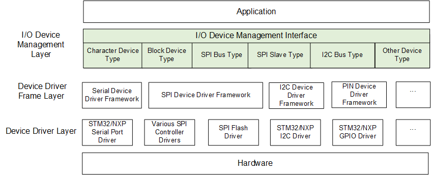
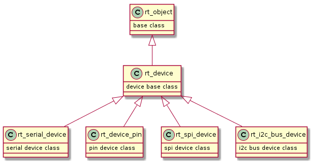

# RT-Thread设备驱动编程

绝大部分的嵌入式系统都会包含一些I/O设备，例如仪器上的显示屏，串口通信，以太网设备等。为了方便管理这些设备，RT-Thread提供了I/O设备管理层，如果用户将自己系统中使用到的I/O设备适配到RT-Thread的I/O设备管理层，使用设备管理层API进行应用代码的编写，这样会在很大程度上降低用户代码与硬件设备的耦合，当然也会增加一部分存储的开销。

对于简单的设备可以直接将设备驱动接口注册到I/O设备管理层，但是对于一些功能丰富的设备RT-Thread会针对具体的设备抽象出同样类型的设备，例如串口设备，不同的硬件平台会有不同的串口外设，针对这些串口外设共同的特点抽象出具体的设备驱动框架层。

综上所述RT-Thread的设备注册管理方式有如下两种：

简单设备注册流程

```shell
设备驱动 -> I/O设备管理层
```

复杂设备注册流程

```shell
设备驱动 -> 设备驱动框架层 -> I/O设备管理层
```

使用上述任意一种方法完成设备的注册后便可以使用上层的I/O设备管理框架操作设备。从上述的俩种方式我们可以看到，设备驱动对于不同的硬件平台是不同的，设备驱动框架层与I/O设备管理层对于所有的平台是一致的，所以如果使用I/O设备管理层去代替直接使用底层驱动会极大程度降低应用与底层驱动的耦合,但是也会增加存储开销，从整齐来看，对于较大容量的设备，使用RT-Thread设备管理框架会降低代码的耦合提高程序的可读性。

在我们了解了设备驱动框架的作用后，再来详细的看一下RT-Thread的I/O设备模型框架：



从上图可以清晰的看到，I/O设备管理分为3层，从上到下分别是 I/O 设备管理层、设备驱动框架层、设备驱动层。应用程序通过 I/O 设备管理接口获得正确的设备驱动，然后通过这个设备驱动与底层 I/O 硬件设备进行数据（或控制）交互。I/O 设备管理层实现了对设备驱动程序的封装。应用程序通过图中的"I/O设备管理层"提供的标准接口访问底层设备，设备驱动程序的升级、更替不会对上层应用产生影响。这种方式使得设备的硬件操作相关的代码能够独立于应用程序而存在，双方只需关注各自的功能实现，从而降低了代码的耦合性、复杂性，提高了系统的可靠性。

RT-Thread采用面向对象的管理方式，对于具体的设备类型采用继承的方式去实现各层级的控制块。接下来我们看一下RT-Thread各设备类型控制块的继承关系，示意图如下：



从上图可以看出设备驱驱动控制块的最底层的得到对象是RT-Thread的rt_object类型，这是RT-Thread的基础的控制块类型，第二层就是我们要介绍的设备类型的控制块，与线程，IPC等一致，设备与这些控制块类型处于同级别，与线程对象不同的是，对于设备对象来说，设备对象类型下会有各种具体的设备类型，这些具体的设备类型继承于第二层的设备被类型，在设备类型的基础上添加了自身设备类型的专有属性。

添加第三层的原因是对于具体的设备对象，有些设备对象是比较复杂的，如果直接适配注册当I/O设备框架层，那么对于不同的设备的适配工作还是比较复杂的，具体到某种具体的设备类型，例如串口，在不同的平台上设备本身就是存在差异的，但是对于串口来说，各个平台下的该设备的行为是一致的，所以在设备框架层下，对于一些比较复杂的设备来说可以进一步将同类型设备的公共行为抽象出来，这部分抽象就是设备驱动框架层，有了设备驱动框架层， 相比直接适配到I/O设备框架层会减少很多工作量。

接下来我们首先介绍RT-Thread的设备框架层，并以一个极简的例子来说明T-Thread的设备框架层的使用。上文我们提到过，只要是对接到RT-Thread的设备驱动就可以使用最上层的设备管理框架的API去操作底层的物理设备。我们来详细的看一下I/O设备管理层的API。

这里首先介绍如何在RT-Thread中使用I/O管理框架创建设备I/O控制块：

```c
rt_device_t rt_device_create(int type, int attach_size);
```

第一个参数为设备的类型：RT-Thread支持的设备类型；

第二个参数为设备的类型：用户数据的大小；

返回值：创建的设备的句柄；

调用该函数时，系统将从堆中动态分配一个设备控制块，大小是struct rt_device 和 attach_size 的和，在不使用该设备时，用户可以调用rt_device_destroy将设备销毁。

完成设备的创建后，此时该设备只是一个单独的设备，并不在系统的管理当中，在RT-Thread中存在一个对象管理容器，只有将创建的设备注册到对象管理容器即可，设备通过链表挂载到对象管理容器，这样我们就可以通过名称使用rt_device_find找到创建的设备。下文我们依次介绍上述提到的函数。

```c
void rt_device_destroy(rt_device_t device);
```

第一个参数为设备的句柄；

接下来是将设备注册到对象管理器的函数：

```c
rt_err_t rt_device_register(rt_device_t dev,
                            const char *name,
                            rt_uint16_t flags);
```

第一个参数为设备的句柄；

第二个参数为设备的名称：在期望操作该设备时，使用rt_device_find便可通过名字找到该设备的句柄；

第三个参数为设备的属性；

我们在注册设备前，需要将设备需要的I/O管理函数注册到创建的设备中，这样在注册后才能通过设备管理句柄操作函数操作设备。例如如下的方式：

```c
rt_device_t test_dev = rt_device_create(RT_Device_Class_Char, 0);

test_dev->init    = drv_test_init;
test_dev->open    = drv_test_open;
test_dev->close   = drv_test_close;
test_dev->read    = drv_test_read;
test_dev->write   = drv_test_write;
test_dev->control = drv_test_control;
```

与注册设备相对应的是取消注册：

```c
rt_err_t rt_device_unregister(rt_device_t dev);
```

取消设备的注册，可以将当前设备从对象管理器移除。

当完成设备得到注册后，我们便可以使用I/O设备管理框架中的函数去操作设备。

我们可以使用rt_device_find通过名称找到设备的句柄，函数如下图所示：

```c
rt_device_t rt_device_find(const char *name)
```

第一个参数为设备的名称；

首先需调用rt_device_init初始化设备，该API如下：

```c
rt_err_t rt_device_init(rt_device_t dev);
```

第一个参数为设备的句柄：调用该API可以对设备进行初始化。

在完成设备的初始化后，可以调用设备的open函数rt_device_open打开设备，在打开设备时也会检查设备是否初始化，如果设备未初始化则先将设备初始化，与初始化设备的API不同的是，在对接设备驱动通常将设备的初始化部分在初始化函数rt_device_init实现，实际的使能在rt_device_open中实现。这样在调用rt_device_init具备了工作的条件，但是设备实际工作需要使用rt_device_open进行使能。

打开设备的函数如下：

```c
rt_err_t rt_device_open(rt_device_t dev, rt_uint16_t oflags);
```

第一个参数为设备的句柄；

第二个参数为设备的打开模式标志，在打开设备的函数中会根据该标志去执行不同的行为。

与打开设备对应的是关闭设备的函数rt_device_close，该函数如下：

```c
rt_err_t rt_device_close(rt_device_t dev)
```

调用该函数将关闭该设备，关闭设备将失能设备，硬件设备便不可以再使用，重新使用需要重新打开。

当打开设备后可以使用操作设备的一些函数，例如对设备的读写，首先我们看设备的读函数：

```c
rt_size_t rt_device_read(rt_device_t dev, rt_off_t pos,void* buffer, rt_size_t size);
```

第一个参数为设备的句柄；

第二个参数为设备的偏移量，该参数更加与不同的设备有不同的含义；

第三个参数为设备的buffer, 用于从设备中读取数据并存放在buffer中，缓存区的最大长度是size.

接下看来我们介绍设备的写入函数：

```c
rt_size_t rt_device_write(rt_device_t dev, rt_off_t pos,const void* buffer, rt_size_t size);
```

第一个参数为设备的句柄；

第二个参数为设备的偏移量，该参数更加与不同的设备有不同的含义；

第三个参数为设备的buffer, 用于放置要写入的数据；

第四个参数为要写入的数据的大小；

除此之外，还有对设备操作的控制函数，控制函数如下：

```c
rt_err_t rt_device_control(rt_device_t dev, rt_uint8_t cmd, void* arg);
```

第一个参数为设备的句柄；

第二个参数为控制命令；

第三个参数为命令参数；

上文详细的介绍了RT-Thread的I/O设备管理框架，接下来我们以一个I/O设备管理框架的实际的使用示例来介绍RT-Thread，下述是示例代码：

```c
#include <rtthread.h>
#include <rtdevice.h>
#include "rtt_board.h"

static rt_err_t drv_test_init(rt_device_t dev)
{
    rt_kprintf("Test drv init!\n");
    return RT_EOK;
}

static rt_err_t drv_test_open(rt_device_t dev, rt_uint16_t oflag)
{
    rt_kprintf("Test drv open flag = %d.\n", oflag);
    return RT_EOK;
}

static rt_err_t drv_test_close(rt_device_t dev)
{
    rt_kprintf("Test drv close!\n");
    return RT_EOK;
}

static rt_ssize_t drv_test_read(rt_device_t dev, rt_off_t pos, void *buffer, rt_size_t size)
{
    rt_kprintf("Test drv read pos = %d, size = %d.\n", pos, size);
    return size;
}

static rt_ssize_t drv_test_write(rt_device_t dev, rt_off_t pos, const void *buffer, rt_size_t size)
{
    rt_kprintf("Test drv write pos = %d, size = %d.\n", pos, size);
    return size;
}

static rt_err_t drv_test_control(rt_device_t dev, int cmd, void *args)
{
    rt_kprintf("Test drv control cmd = %d.\n", cmd);
    return RT_EOK;
}

int rt_drv_test_init(void)
{
    rt_device_t test_dev = rt_device_create(RT_Device_Class_Char, 0);
    if(!test_dev)
    {
        rt_kprintf("Test drv create failed!\n");
        return -RT_ERROR;
    }

    test_dev->init    = drv_test_init;
    test_dev->open    = drv_test_open;
    test_dev->close   = drv_test_close;
    test_dev->read    = drv_test_read;
    test_dev->write   = drv_test_write;
    test_dev->control = drv_test_control;

    if(rt_device_register(test_dev, "test_drv", RT_DEVICE_FLAG_RDWR) != RT_EOK)
    {
        rt_kprintf("Test drv register failed!\n");
        return -RT_ERROR;
    }

    return RT_EOK;
}
INIT_BOARD_EXPORT(rt_drv_test_init);

static int drv_sample(void)
{
    rt_device_t test_dev = rt_device_find("test_drv");
    if(test_dev == RT_NULL)
    {
        rt_kprintf("Can not find test drv!\n");
        return -RT_ERROR;
    }

    // Initialising a device
    rt_device_init(test_dev);
    // Open Device
    rt_device_open(test_dev, RT_DEVICE_OFLAG_RDWR);
    // Control Device
    rt_device_control(test_dev, RT_DEVICE_CTRL_CONFIG, RT_NULL);
    // Write data to the device
    rt_device_write(test_dev, 100, RT_NULL, 1024);
    // Read data from device
    rt_device_read(test_dev, 20, RT_NULL, 128);
    // Turn off the device
    rt_device_close(test_dev);
    // Unregistered device
    rt_device_unregister(test_dev);
    // Destruction device
    rt_device_destroy(test_dev);

    return RT_EOK;
}
MSH_CMD_EXPORT(drv_sample, enable test drv sample);
```

上述示例，是我们人为构建的一个设备，该设备没有实际的意义仅用于测试RT-Thread的I/O设备管理框架。

首先是实现的I/O设备操作方法，有如下几个方法：

-  drv_test_init
-  drv_test_open
-  drv_test_close
-  drv_test_read
-  drv_test_write
-  drv_test_control

上述函数对应着RT-Thread的I/O设备管理框架中的操作方法，在将上述设备注册到对象管理器中前需要将设备的I/O设备操作方法初始化为上述的具体的方法，然后再将设备注册到对象管理器。

完成设备的注册后，用户就可以使用rt_device_find函数结合设备的名称从对象管理器中找到该设备的句柄，从而使用对象的操作函数对对象进行操作。

当完成设备的注册后，用户使用RT-Thread的I/O设备管理框架的方法如下

1. 通过rt_device_find函数找到设备的句柄
2. 使用rt_device_init对设备进行初始化
3. 使用rt_device_open打开设备，这一步会对设备的引用次数等属性进行操作，同时设备的数据收发的使能通常也在这一步进行配置。
4. 接下来就可以使用rt_device_control对设备参数进行配置，使用rt_device_write向设备写数据，使用rt_device_read从设备读数据。
5. 当不期望使用该设备时，调用rt_device_close将设备关闭，如果多次打开，设备底层的去初始化将在最后一次执行。
6. 如果我们暂时不想使用该设备了，也可以使用rt_device_unregister将设备从对象管理器中移除。
7. 如果我们彻底不需要该设备，就就可以使用rt_device_destroy将动态创建设备时申请的空间释放，需要注意的是在销毁设备前一定要将设备取消注册，否则不能进行销毁。这就是RT-Thread的I/O设备管理框架的使用方法。