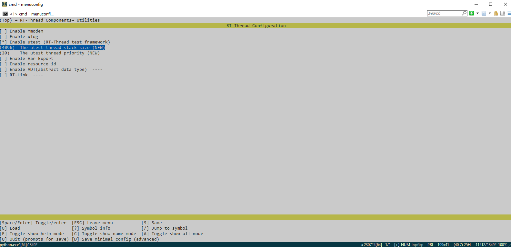
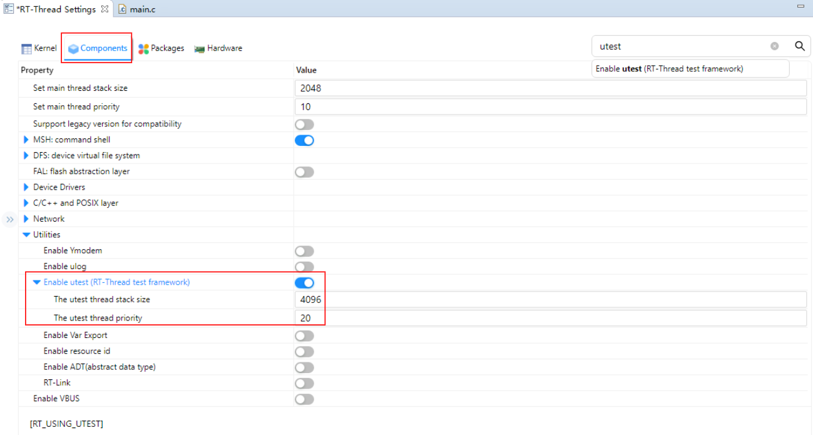
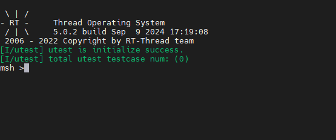

### RT-Thread System Components

In addition to the basic RTOS kernel, RT-Thread also contains a rich set of components, such as FinSH components, FAL components, DFS components, ULOG components, UTEST components, etc. In the standard version of RT-Thread, you can configure the above components to be added to the system project, and through the above components, you can reduce the coupling of the code and enrich the system's The above components can reduce the code coupling and enrich the system functions.

Here we take the UTEST component as an example, which is the unit testing framework developed by RT-Thread. The original purpose of designing utest is to facilitate RT-Thread developers to use a unified framework interface to write test programs and achieve the purpose of unit testing, coverage testing and integration testing.

If you use env environment configuration to compile and develop RT-Thread, you can use the menuconfig command to configure and select the UTEST component, and add it to the system for compilation, the way to add is as follows:

After selecting the utest component through the menuconfig tool, the component will be added to the system project, and then compiled and burned to the target platform by using the scons command, then the UTSET component can be used.

If you use RT-Studio, RT-Thread's own IDE, you only need to click RT-Thread Settings to open the option of utest component, and then Ctrl+S to save the configuration, then you can add UTSET component to the build.

After compiling the UTEST components to the system firmware, the firmware is burned to the target device and runs as follows:

We can see that the terminal outputs a green character message, indicating that the UTEST component has been successfully added.

The above is how to add system components to RT-Thread, in addition to the UTEST component, there are FAL and other abstraction layers, the use of these components can greatly reduce the coupling of the application.