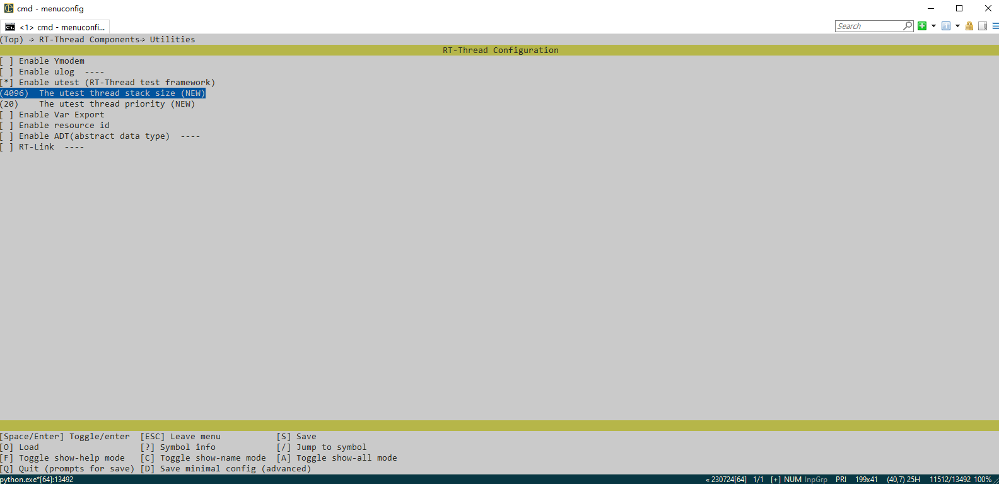
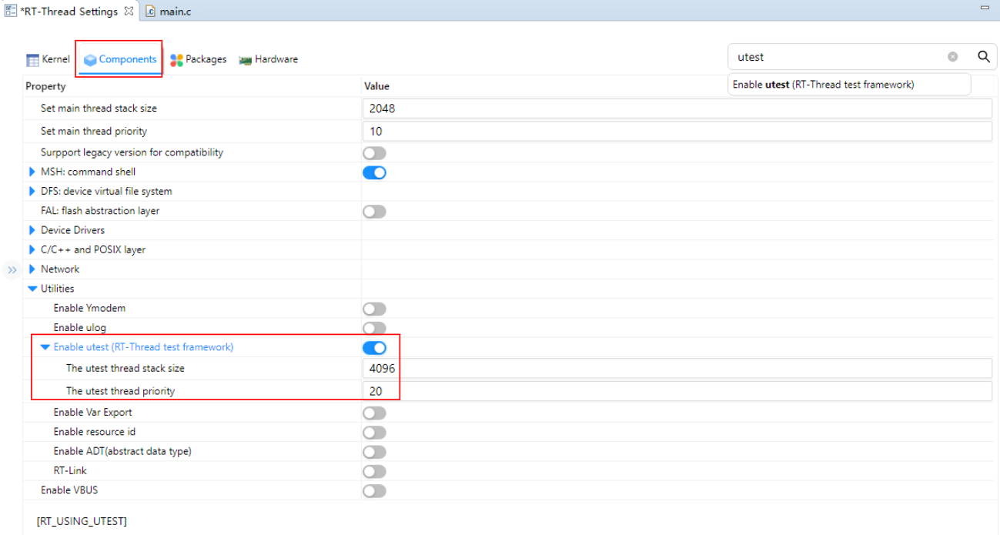
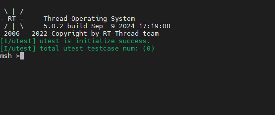

# RT-Thread系统组件

除了基础的RTOS内核，RT-Thread还包含丰富的组件，例如FinSH组件，FAL组件，DFS组件，ULOG组件，UTEST组件等，在RT-Thread标准版本中，可以通过配置的方式将上述组件添加至系统工程中，通过上述组件可以降低代码的耦合性，丰富系统的功能。

这里我们以UTEST组件为例介绍，UTEST组件是 RT-Thread 开发的单元测试框架。设计 utest 的初衷是方便 RT-Thread 开发者使用统一的框架接口编写测试程序，实现单元测试、覆盖测试以及集成测试的目的。

如果使用env环境配置编译开发RT-Thread，可以使用menuconfig命令配置选中UTEST组件，将其添加至系统中进行编译，添加方式如下：

通过menuconfig工具配置选择utest组件后该组件便被添加至系统工程，使用scons命令进行编译烧录至目标平台，即可使用UTSET组件。

如果使用RT-Thread自主开发的IDE RT-Studio，用户只需要点击RT-Thread Settings将utest组件的选项打开，然后Ctrl+S保存配置，便可以将UTEST组件添加至构建。

将UTEST组件编译至系统固件后，将固件烧录至目标设备，运行结果如下：

我们可以看到终端输出了绿色的字符信息，表示UTEST组件添加成功。

上述便是RT-Thread添加系统组件的方法，除了UTEST组件，还有FAL之类的抽象层，使用这些组件可以极大程度降低应用程序的耦合性。