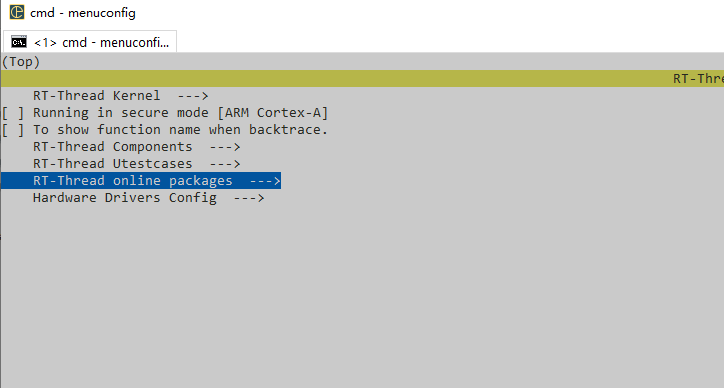
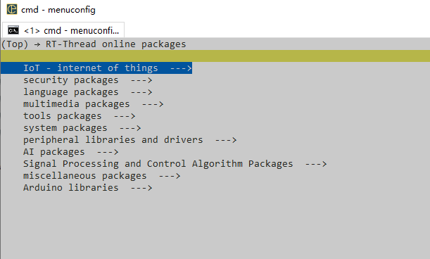

### RT-Thread Online Packages

In the previous section, we introduced RT-Thread's system components, which are some commonly used components developed by RT-Thread in the process of developing embedded systems. In addition to these system components, RT-Thread also has a number of online packages, which exist in the form of online packages, so that when the user needs certain functional components, he or she can download the packages locally and add them to the system build by means of online packages. When users need certain functional components, they can download the packages locally and add them to the system build.

RT-Thread currently has 703 online packages, with 14138870 downloads and 204 contributors.

The online packages are available in the following categories: IOT, Peripherals, System, Programming Languages, Tools, Multimedia, Security, Embedded AI, Signal Processing and Control, RTDUINO and Miscellaneous. Users can choose their desired package from the above categories.

If you use env environment configuration to compile and develop RT-Thread, you can use the menuconfig command to configure the desired package and add it to the system for compilation, the way to add is as follows:

Firstly, open env, type pkgs --upgrade to update the package index, this step will update the index of the newly added package to the local, use the menuconfig tool to open the configuration menu, configure and select your desired online package, save the configuration. The options for adding online packages are as follows:

Go to the `RT-Thread online packages` option to see all the categorised online packages:

Go to the specific option above to select the desired online package, press Ctrl + S to save the configuration locally and exit the configuration when you are done.

Execute pkgs --update in env to update the package locally, take the kernel sample component as an example, the following is the procedure to download the component locally.

After you finish pulling the components, you can compile the online package together by executing scons recompile in env.

If you use RT-Studio development environment, the above steps will be more simple, in RT-Studio project click `RT-Thread Settings` to configure, find the `Packages` option, under this option is all kinds of online packages of RT-Thread, the configurations view is as follows:

After selecting the desired online package, press `Ctrl + S` to download the package and add it to the project, and recompile to add the package to the project build.

The above is how to add RT-Thread packages in different environments. After adding the packages, a packages folder will be created in the project directory, from which we can find the packages we added.

