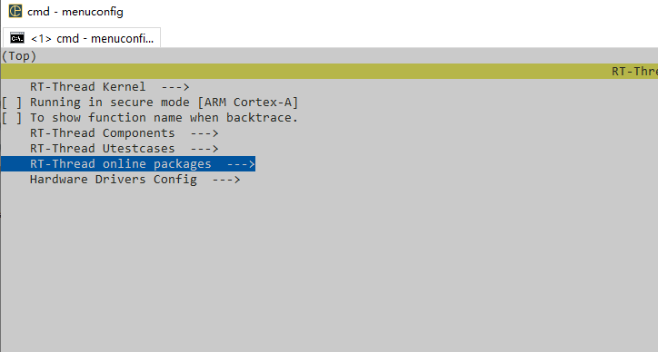
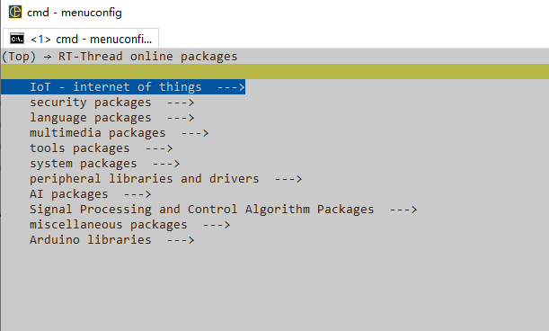
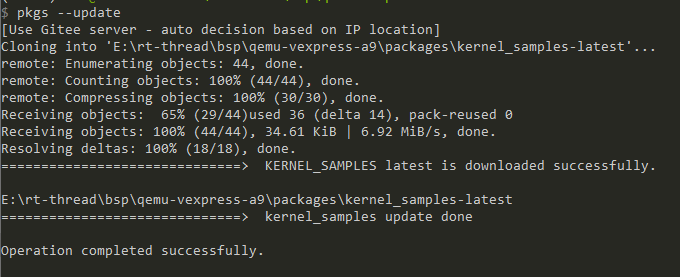
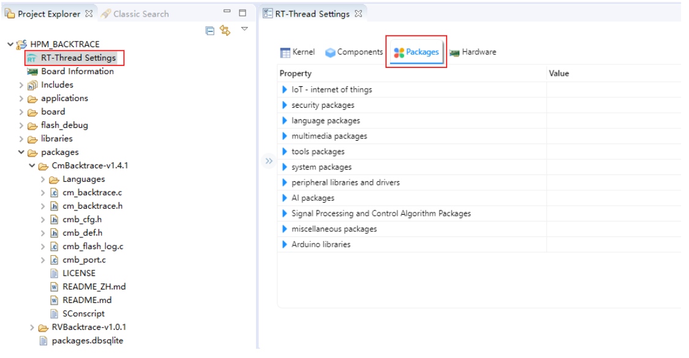

# RT-Thread在线软件包

上节我们介绍了RT-Thread的系统组件，系统组件是由RT-Thread开发的一些在开发嵌入式系统过程中的常用组件，除了这些系统组件，RT-Thread还有许多的在线软件包，这些软件包以在线的形式存在，当用户需要某些功能的组件时，通过在线的方式将软件包下载至本地并添加至系统构建。

RT-Thread当前有703个在线软件包，软件包的下载量高达14138870，有204位贡献者参与了在线软件包的贡献。

在线软件包总共有如下的几类：IOT，外设，系统，编程语言，工具，多媒体，安全，嵌入式AI，信号处理与控制，RTDUINO与杂类软件包。用户可以从上述各类软件包中选择自己期望的软件包。

如果使用env环境配置编译开发RT-Thread，可以使用menuconfig命令配置选中期望的软件包，将其添加至系统中进行编译，添加方式如下：

首先打开env，输入pkgs --upgrade更新软件包索引，该步骤将会更新新添加的软件包的索引至本地，使用menuconfig工具打开配置菜单，配置选择自己期望的在线软件包，保存配置。添加在线软件包的选项如下：

进入`RT-Thread online packages`选项，可以看到所有分类的在线软件包：

进入上述具体选项选择期望选择的在线软件包，选择完成后按Ctrl + S保存配置至本地，退出配置。

在env中执行pkgs --update将软件包更新至本地，这里以内核示例组件为例，下述是将组件下载至本地的过程。

完成组件的拉取后，在env中执行scons重新编译便可以将在线软件包一起编译。

如果采用RT-Studio开发环境开发，上述的步骤会更加简单一些，在RT-Studio的工程中点击`RT-Thread Settings`进行配置，找到`Packages`选项，该选项下即为RT-Thread的各类在线软件包，配置视图如下：

选择期望的在线软件包后，按`Ctrl + S`会自动将软件包下载并添加至工程，重新编译便可以将软件包添加至工程构建。

上述便是RT-Thread软件包在不同环境下的添加方式，添加完成后会在工程目录下生成一个packages文件夹，我们可以从该文件夹中找到我们添加的软件包。

