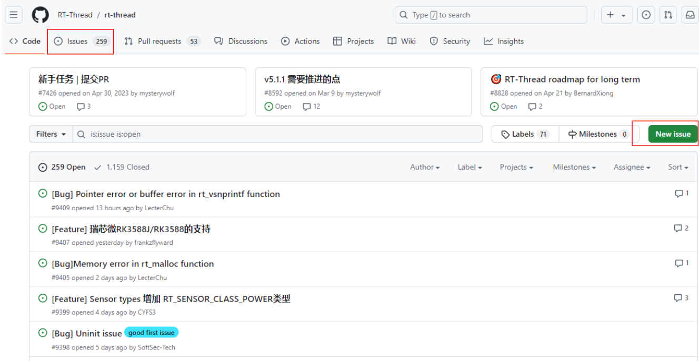
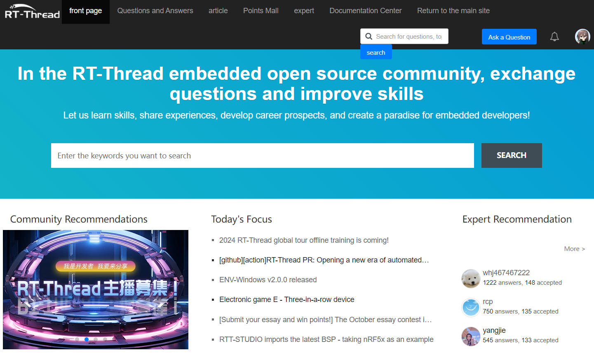
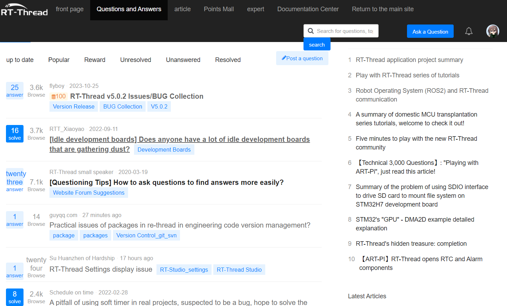

# 如何参与RT-Thread

RT-Thread作为一个开源的RTOS，拥有许多的爱好者参其中，同时一直在不停的更新迭代，通常我们在开发时可能会发现代码中存在bug，这个时候如果我们发现问题但是没有找到合适的解决办法，可以将发现的问题提交至github的[issue选项](https://github.com/RT-Thread/rt-thread/issues)，示例如下：

我们可以点击`New issue`选项创建新的issue， 社区开发者会参与到issue的讨论解决。

这个时候如果我们发现问题并找到了合适的解决办法，可以提交pr至主线仓库，如果是新手可以查看[提交代码至gitla的方法](https://www.rt-thread.io/document/site/development-guide/github/github/#contribution-process_1)。

提交至gitlab的代码每天都会有专门的人参与审核。

在开发的过程中如果遇到问题，我们可以通过在[论坛](https://club.rt-thread.org/index.html)发帖提出自己的问题，在这里会有很多热情的小伙伴参与问题的讨论。

除此之外，如果在学习过程中有所感悟，可以将自己的感悟写成文章，发表在论坛让更太多的开发者看到，论坛的首页如下：

论坛的提问与发表的文章如下：

最后欢迎大家可以参与到RT-Thread的开发，为开源RTOS做出你的贡献。

